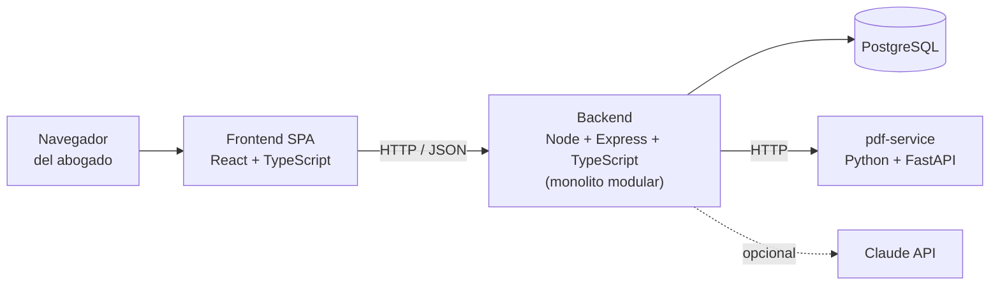

# Arquitectura del Proyecto

## Sistema de Gestión Integral para Estudios Jurídicos

Trabajo Final Integrador — 2.ª Entrega
Martín Maine · Gevont Utmazian — Tutor: Sergio Andrés Antonini

---

## 1. Arquitectura elegida

**Monolito modular con un microservicio auxiliar.**

Un único despliegue de backend, organizado internamente en módulos de
responsabilidad única que se comunican por interfaces explícitas. Cada módulo es
dueño de sus tablas y ningún módulo consulta directamente las tablas de otro.

Aparte queda **un solo microservicio**: el conversor de PDF a texto, en Python.



### Por qué monolito modular y no microservicios

Para un equipo de dos personas en un cuatrimestre, una arquitectura de
microservicios completa sería **sobreingeniería**: multiplicaría los despliegues,
obligaría a resolver comunicación entre servicios, consistencia distribuida y
observabilidad, y nada de eso aporta valor al problema que resolvemos.

El monolito modular da la ventaja que sí necesitamos —límites claros entre
módulos— sin el costo operativo. Si en el futuro un módulo justifica separarse,
las fronteras ya están definidas y la extracción es mecánica.

### Por qué el conversor de PDF sí va separado

Es la **única** excepción, y tiene tres razones concretas:

1. Está escrito en **Python**, no en TypeScript: `pdfplumber` es la herramienta
   adecuada para extraer texto de PDF y no tiene equivalente en el ecosistema
   Node. Aislarlo evita meter un segundo runtime dentro del backend.
2. Su trabajo es **asíncrono y pesado**: procesar un PDF puede tardar. Si
   estuviera dentro del backend, bloquearía capacidad de la API.
3. Si se cae, **el sistema sigue funcionando**: el documento queda en cola y se
   procesa después. La subida nunca falla por culpa del conversor.

---

## 2. Capas del backend

Cada módulo se organiza en cuatro capas, de afuera hacia adentro:

| Capa | Responsabilidad |
|---|---|
| **Rutas** | Define los endpoints HTTP y aplica los middlewares |
| **Controlador** | Traduce HTTP a llamadas de negocio: valida entrada, arma la respuesta |
| **Servicio** | La lógica de negocio. No sabe que existe HTTP. |
| **Repositorio** | El acceso a la base. Es el único que escribe SQL. |

La regla que ordena todo: **las dependencias apuntan hacia adentro**. El servicio
no conoce al controlador, el repositorio no conoce al servicio. Así la lógica de
negocio se puede probar sin levantar un servidor ni una base.

Tres middlewares son transversales a todos los módulos:

- **Autenticación** — valida el token JWT y resuelve el usuario.
- **Autorización** — comprueba el permiso `modulo.accion` contra el rol.
- **Auditoría** — registra automáticamente toda acción sensible. Al estar en el
  middleware y no repartido por los controladores, **ninguna acción puede quedar
  sin auditar por olvido**.

---

## 3. Tecnologías definitivas

| Capa | Tecnología | Dónde se despliega |
|---|---|---|
| Frontend (SPA) | React + TypeScript (Vite) | Vercel |
| Backend / API REST | Node.js + Express + TypeScript | Render |
| Base de datos | PostgreSQL | Neon |
| Microservicio PDF → texto | Python + FastAPI + `pdfplumber` | Render |
| Autenticación | JWT + Passport.js | (dentro del backend) |
| IA (opcional) | Claude API (Anthropic) | SaaS externo |
| Entorno local | Docker + Docker Compose | — |
| Versionado y gestión | Git + GitHub + GitHub Projects | GitHub |

---

## 4. Justificación de las decisiones técnicas

**React + TypeScript en el frontend.** El navegador solo interpreta JavaScript,
así que el lenguaje está dado. Elegimos React por tener la comunidad más grande y
la curva más accesible para un equipo chico. TypeScript permite compartir
lenguaje y tipos con el backend, lo que reduce el costo de cambiar de contexto.

**Node + Express + TypeScript en el backend.** Unifica el lenguaje con el
frontend. El modelo de entrada/salida no bloqueante de Node encaja con una
aplicación de muchas lecturas concurrentes (consultar causas, vencimientos,
notificaciones). Express es minimalista y maduro.

**PostgreSQL y no una base documental.** Tres razones:

1. **La estructura es estable.** Causas, plazos, costas y usuarios tienen un
   esquema claro que no cambia seguido. No hay nada que justifique esquema libre.
2. **Las relaciones son densas.** El esquema tiene 73 claves foráneas y la
   consulta típica —"qué vence esta semana, de qué causa y quién es el
   responsable"— cruza cinco tablas. En una base documental habría que duplicar
   datos o resolver los cruces en la aplicación.
3. **Hay dinero y plazos perentorios.** Registrar un cobro tiene que actualizar
   la costa y el pago en una sola transacción, o queda inconsistente. Eso pide
   garantías ACID.

PostgreSQL además tiene tipos y funciones de fecha potentes, que es exactamente
lo que necesita el cómputo de plazos.

**Python para el PDF.** Ver la sección 1.

**Claude API como dependencia opcional.** Aporta análisis de textos legales que
no es viable desarrollar internamente en el plazo del proyecto. Se integra con
**degradación elegante**: si no hay clave de API o créditos, el sistema funciona
completo sin las funciones de IA. Ninguna parte del núcleo depende de ella.

**JWT + Passport.js.** Estándar de facto para APIs REST sin estado.

**Docker y Docker Compose, sin Kubernetes.** Compose levanta frontend, backend,
microservicio y base con un comando, que es lo que necesitamos para trabajar de a
dos y para la demostración. Kubernetes sería sobreingeniería.

**Vercel + Render + Neon.** Los tres tienen capa gratuita suficiente y cumplen el
requisito de la cátedra de tener el sistema accesible online. Se descartó
*serverless* puro para el backend porque hay tareas programadas —la revisión
diaria de vencimientos— que necesitan un proceso con estado.

---

## 5. Estructura del repositorio

```
sistemalegal/
├── README.md              Descripción del proyecto y tecnologías
├── docs/                  Documentación de las entregas
│   ├── propuesta-proyecto.md        1.ª entrega
│   ├── arquitectura.md              este documento
│   ├── esquema-base-de-datos.md     modelo de datos y DER
│   └── listado-modulos.md           módulos a desarrollar
├── database/              Esquema PostgreSQL
│   ├── migrations/        Migraciones versionadas (fuente de verdad)
│   ├── seed/              Catálogos base y datos ficticios
│   ├── schema.sql         Esquema consolidado
│   └── README.md          Cómo crear la base
├── frontend/              Aplicación React + TypeScript   (Sprint S0)
├── backend/               API Node + Express + TypeScript (Sprint S0)
└── pdf-service/           Microservicio Python            (Sprint S2)
```

`frontend/` y `backend/` están creadas y vacías: la codificación comienza recién
después de que esta entrega sea aprobada.

---

## 6. Decisiones de despliegue

El sistema se despliega en tres servicios independientes:

| Servicio | Qué se despliega | Cómo |
|---|---|---|
| **Vercel** | Frontend | Conectado al repositorio, despliegue automático |
| **Render** | Backend y microservicio PDF | Conectado al repositorio |
| **Neon** | Base de datos | Migraciones aplicadas con `psql` |

**Variables de entorno.** Nada sensible vive en el repositorio. Cada servicio
recibe su configuración por variables de entorno: cadena de conexión a la base,
secreto de JWT y, opcionalmente, la clave de la Claude API.

**Cómo se demuestra.** Para la defensa oral hay dos caminos, y el segundo existe
justamente como respaldo:

1. La aplicación desplegada, accesible desde cualquier navegador.
2. El entorno local con `docker compose up`, que no depende de la conectividad
   ni de que los servicios gratuitos estén despiertos.

---

## 7. Riesgos técnicos y cómo los cubre la arquitectura

| Riesgo | Cobertura |
|---|---|
| El Poder Judicial de Córdoba no ofrece API pública | Los movimientos se cargan a mano o se importan. La tabla ya distingue el origen, así que agregar sincronización automática no requiere migrar datos. |
| El cómputo de plazos es un dominio complejo | Las reglas procesales y los días inhábiles son **datos configurables**, no código. El motor de cómputo vive en el backend para poder cubrirlo con pruebas automatizadas. |
| Dependencia de la Claude API | Es opcional y degrada con elegancia. |
| Datos personales sensibles (Ley 25.326) | Solo datos ficticios en desarrollo, control de acceso por rol, auditoría de acciones sensibles y cifrado en reposo. |
| Alcance amplio para dos personas | Priorización MoSCoW: causas y plazos son *Must*; costas, plantillas, tareas e IA pueden recortarse sin romper el núcleo. |
