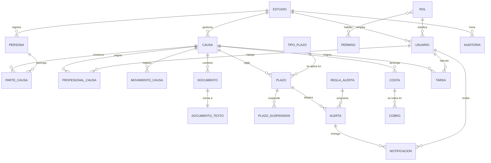
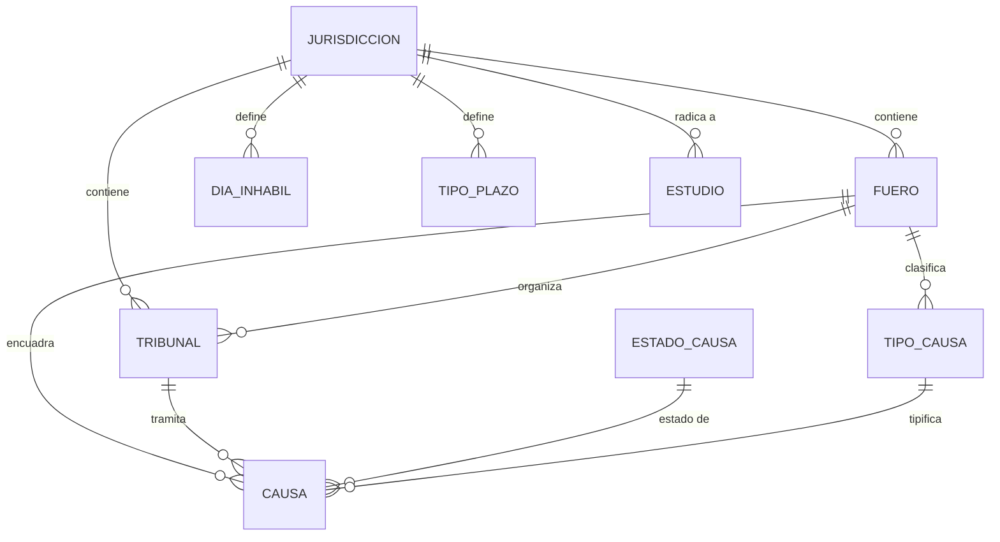
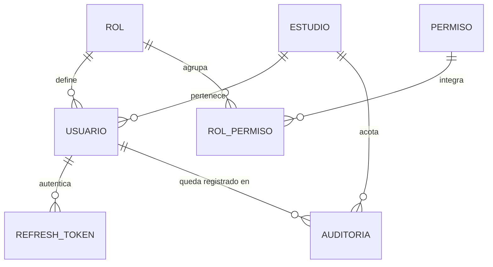

# 2.ª Entrega — Diseño de Base de Datos y Listado de Módulos

## Sistema de Gestión Integral para Estudios Jurídicos

---

## 1. Datos de la entrega

| Campo | Detalle |
|---|---|
| **Asignatura** | Trabajo Final Integrador — Tecnicatura Universitaria en Programación a Distancia |
| **Integrantes** | Martín Maine (`@martinmaine`) · Gevont Utmazian (`@gevontutmazian8`) |
| **Tutor** | Sergio Andrés Antonini |
| **Repositorio** | https://github.com/martinmaine/sistemalegal |
| **Hito** | 2.ª Entrega — Diseño y módulos (condición de Regular) |
| **Fecha máxima** | 27/09 |
| **Entregable requerido** | Esquema de la base de datos relacional + listado de módulos |
| **Documento previo** | [`propuesta-proyecto.md`](propuesta-proyecto.md) (1.ª entrega) |

---

## 2. Alcance de este documento

Este documento cubre exactamente lo que pide el hito: **el esquema relacional** y
**el listado de módulos** del MVP (Fase 1). No incorpora funcionalidad nueva: todo
lo que se modela aquí ya estaba comprometido en el alcance del MVP definido en la
Sección 3.3 de la propuesta.

Se entrega junto con el código SQL ejecutable, que es la materialización del
diseño y no un anexo:

| Artefacto | Ubicación |
|---|---|
| Migraciones versionadas (fuente de verdad) | [`../db/migrations/`](../db/migrations/) |
| Esquema consolidado | [`../db/schema.sql`](../db/schema.sql) |
| Configuración base | [`../db/seed/001_catalogos.sql`](../db/seed/001_catalogos.sql) |
| Datos ficticios de demostración | [`../db/seed/002_datos_demo.sql`](../db/seed/002_datos_demo.sql) |
| Instrucciones de uso | [`../db/README.md`](../db/README.md) |

**Cifras del esquema:** 34 tablas · 3 vistas · 73 claves foráneas · 3 funciones ·
137 sentencias DDL.

---

# Parte I — Diseño de la base de datos

## 3. Criterios de diseño

### 3.1. Por qué un modelo relacional

La justificación se desarrolló en la Sección 5.2 de la propuesta y el diseño la
confirma en concreto:

| Criterio | Evidencia en este esquema |
|---|---|
| **Estructura estable y bien definida** | Las 34 tablas tienen columnas tipadas y acotadas; ninguna entidad requiere esquema variable. |
| **Relaciones densas entre entidades** | 73 claves foráneas. La consulta típica ("causas con vencimientos de esta semana y su responsable") cruza 5 tablas. |
| **Integridad transaccional** | Registrar un cobro modifica `cobro` y el `estado_cobro` de `costa` en una sola transacción. Son datos de dinero y de plazos perentorios: no admiten estados intermedios inconsistentes. |

### 3.2. Multi-inquilino (multi-estudio)

El sistema es **SaaS multi-estudio**: una sola instancia atiende a varios
estudios jurídicos. Esto es lo que da sentido al rol Super Admin declarado en la
propuesta.

La estrategia elegida es **base compartida con discriminador de inquilino**:

- `estudio` es la raíz del inquilino.
- Toda tabla de negocio lleva `estudio_id NOT NULL` con clave foránea e índice.
- `usuario.estudio_id` es la **única excepción nullable**, y solo para el
  Super Admin, que opera la plataforma y no pertenece a ningún estudio.

Se descartaron las alternativas: *una base por estudio* (inviable de operar y de
migrar con dos personas) y *un esquema por estudio* (mismo problema, con la
complicación adicional de las migraciones en paralelo).

> **Consecuencia para el backend:** el aislamiento entre inquilinos depende de
> que toda consulta filtre por `estudio_id`. Es una obligación del módulo de
> acceso a datos, no de la base. Se controla en un solo lugar (el repositorio
> base) para que no dependa de la disciplina de cada endpoint.

### 3.3. Convenciones

| Convención | Decisión | Motivo |
|---|---|---|
| **Idioma** | Español, `snake_case` | El dominio jurídico argentino no traduce limpio (*causa* ≠ *case*, *costas* ≠ *costs*). Traducirlo introduciría ambigüedad en el término más importante del sistema. |
| **Claves primarias** | `UUID` con `gen_random_uuid()` | Los identificadores viajan en las URL de una aplicación multi-inquilino; un entero secuencial permitiría enumerar expedientes ajenos. |
| **Excepción** | `auditoria.id` es `BIGINT` de identidad | Tabla *append-only* de alto volumen cuyo id nunca aparece en una URL: no hay riesgo de enumeración y sí un beneficio en tamaño de índice. |
| **Estados fijos** | `CHECK` con lista de valores | Alterar un `ENUM` de PostgreSQL exige migración; un `CHECK` se modifica sin recrear tipos. |
| **Valores configurables** | Tablas de catálogo | Lo que el estudio puede cambiar (tipos de causa, conceptos de costa, días inhábiles) es **dato**, no código. |
| **Fechas y horas** | `TIMESTAMPTZ` | Evita ambigüedad de huso horario. Para fechas procesales sin hora se usa `DATE`. |
| **Dinero** | `NUMERIC(14,2)` | Nunca punto flotante: los importes de costas y honorarios deben ser exactos. |
| **Borrado** | Lógico (`eliminado_en`) en `causa`, `persona`, `documento` | En materia legal no se destruye información. El resto de las tablas usa borrado físico con `ON DELETE` explícito. |
| **Auditoría de fila** | `creado_en` / `actualizado_en` | `actualizado_en` lo mantiene un trigger compartido, no la aplicación. |

### 3.4. Política de borrado en cascada

Cada clave foránea declara explícitamente su comportamiento. No se dejó ninguna
al valor por omisión:

| Comportamiento | Cuándo se usa | Ejemplo |
|---|---|---|
| `ON DELETE CASCADE` | El hijo no tiene sentido sin el padre | Borrar una `causa` borra sus `parte_causa`, `documento`, `plazo` |
| `ON DELETE RESTRICT` | El padre es un catálogo o una entidad que no debe desaparecer con datos vivos | No se puede borrar un `fuero` que tiene causas |
| `ON DELETE SET NULL` | El vínculo es informativo y su pérdida no invalida el registro | Dar de baja un usuario no borra la causa que creó ni su rastro de auditoría |

---

## 4. Diagrama entidad-relación

### 4.1. Vista general



### 4.2. Configuración jurisdiccional

El bloque que hace configurable la operación en otra provincia.



### 4.3. Seguridad y auditoría



---

## 5. Decisiones de modelado

Las siete decisiones que explican por qué el esquema tiene esta forma y no otra.

### 5.1. `persona` es reutilizable; el carácter procesal vive en el vínculo

Una persona **no** se guarda dentro de la causa. El estudio mantiene una agenda
única de personas, y `parte_causa` vincula persona con causa agregando el
carácter (`ACTOR`, `DEMANDADO`, `TERCERO`...).

*Por qué:* la misma persona puede ser demandada en un expediente y cliente en
otro. Si el carácter fuera un atributo de la persona, habría que duplicarla; y
al actualizar un domicilio se actualizaría en una copia sola.

La columna `parte_causa.es_cliente` marca a quién representa el estudio **en esa
causa**, porque tampoco eso es una propiedad estable de la persona.

### 5.2. El texto extraído del PDF vive en su propia tabla

`documento` guarda metadatos; `documento_texto` guarda el texto plano, en
relación 1:1.

*Por qué:* (a) el texto puede pesar megabytes y casi nunca se necesita al listar
documentos; (b) la extracción es **asíncrona** —la hace el microservicio Python—
así que tiene su propio ciclo de vida, su propia fecha y su propio mensaje de
error. `documento.estado_extraccion` funciona además como **cola de trabajo**
del microservicio, con un índice parcial que solo cubre las filas pendientes.

El binario del PDF **no se guarda en la base**: la tabla guarda la ruta al
almacenamiento de objetos. La base almacena metadatos, no archivos.

**La búsqueda es insensible a tildes, y eso no es un detalle cosmético.** El
diccionario español de PostgreSQL reduce `NOTIFICACIÓN` al lexema `notif`, pero
`NOTIFICACION` sin tilde no la reconoce y la deja entera como `notificacion`. Son
lexemas distintos: un abogado que busque sin tildes —lo normal— no encontraría el
documento. Por eso el índice normaliza el texto con `fn_sin_acentos()`, una
envoltura `IMMUTABLE` sobre `unaccent` (la función original es `STABLE` y
PostgreSQL no indexa expresiones que no sean inmutables).

> **Obligación para el módulo `documentos`:** la consulta debe normalizarse con
> la misma función. Si se normaliza solo el índice, la búsqueda vuelve a fallar
> con las tildes y además deja de usar el índice.

### 5.3. El cómputo de plazos se separa en regla, calendario e instancia

Es la pieza central del sistema y la mitigación del riesgo R3 de la propuesta.

| Tabla | Rol |
|---|---|
| `tipo_plazo` | La **regla**: cuántos días, hábiles o corridos, qué artículo la funda |
| `dia_inhabil` | El **calendario**: feriados, feria judicial, asuetos, por jurisdicción |
| `plazo` | La **instancia**: la regla aplicada a una causa concreta |

El algoritmo de cómputo **vive en el backend TypeScript, no en la base**, porque
debe poder probarse con los 10+ casos de prueba que exige el objetivo específico
n.º 2 de la propuesta. Una función PL/pgSQL sería mucho más difícil de cubrir con
pruebas automatizadas y quedaría fuera del monolito modular.

`plazo` persiste **a la vez los insumos y el resultado** del cálculo
(`fecha_notificacion`, `cantidad_dias`, `computo` → `fecha_vencimiento`):

- Guardar solo el resultado impediría auditar cómo se llegó a él.
- Guardar solo los insumos obligaría a recalcular en cada consulta y a suponer
  que el calendario histórico nunca cambia — supuesto falso: los feriados se
  fijan por decreto y pueden cargarse con posterioridad.

`fecha_vencimiento_original` conserva el primer cálculo, de modo que prórrogas y
suspensiones sean visibles sin perder el dato inicial.

**Ninguna regla ni ningún feriado está fijo en el código.** Habilitar otra
provincia es insertar filas en `jurisdiccion`, `fuero`, `tribunal`, `tipo_plazo`
y `dia_inhabil`. Es lo que sostiene la afirmación de arquitectura multi-provincia
de la propuesta.

### 5.4. Política, hecho y entrega son tres cosas distintas en las alertas

| Tabla | Concepto |
|---|---|
| `regla_alerta` | La **política**: "avisar 5 días antes, en nivel INFORMATIVA" |
| `alerta` | El **hecho**: "este plazo concreto dispara ese aviso el día X" |
| `notificacion` | La **entrega**: "a este usuario, por este canal, leída o no" |

*Por qué:* fusionarlas impediría avisar a varios responsables del mismo plazo con
un solo hecho de negocio, y haría imposible distinguir un aviso entregado pero no
leído de uno nunca entregado.

El índice único `uq_alerta_plazo_regla` hace **idempotente** al proceso
programado que recorre los vencimientos: si corre dos veces el mismo día, no
duplica avisos.

### 5.5. Costa y cobro son tablas separadas

`costa` es lo devengado; `cobro` es cada pago imputado, en relación 1:N.

*Por qué:* una costa puede cobrarse en cuotas. Un único campo `monto_cobrado` en
`costa` perdería el detalle de cada pago —fecha, medio, comprobante—, que es
justamente lo que exige el objetivo de "control de cobros pendientes".

`costa.estado_cobro` es **derivable** de la suma de cobros, pero se persiste para
poder indexar el tablero de cobranza sin agregar en cada consulta. Es una
desnormalización deliberada; la vista `vw_costa_saldo` permite contrastarlo
contra la suma real y detectar cualquier divergencia.

### 5.6. La auditoría es una tabla genérica, no un historial por entidad

`auditoria` usa `entidad` + `entidad_id` + `datos_antes`/`datos_despues` en
`JSONB`.

*Por qué:* el requisito es registrar "acciones sensibles" sobre cualquier
entidad. Una tabla de historial por entidad duplicaría el esquema y obligaría a
tocar la auditoría cada vez que se agrega una tabla de negocio. Con este diseño,
auditar algo nuevo no requiere ninguna migración.

`usuario_id` es `ON DELETE SET NULL`: dar de baja a un usuario **no puede borrar
el rastro de lo que hizo**. Su identidad queda preservada dentro de `datos_antes`.

### 5.7. Las funciones de IA no tienen dependientes

Ninguna tabla del núcleo referencia a `consulta_ia`; la dependencia va siempre en
sentido contrario. Es lo que permite la **degradación elegante** exigida por el
riesgo R4: sin clave de API el sistema funciona completo, y el estado
`SIN_SERVICIO` deja constancia de las consultas que no se pudieron atender.

Registrar `tokens_entrada`, `tokens_salida` y `costo_estimado` permite controlar
el gasto de la API, que es precisamente lo que hace riesgosa la dependencia.

---

## 6. Normalización

El esquema está en **Tercera Forma Normal (3FN)**:

| Forma | Verificación |
|---|---|
| **1FN** | Todos los atributos son atómicos. No hay campos multivaluados ni listas separadas por comas: las relaciones N:M se resuelven con tablas (`parte_causa`, `profesional_causa`, `rol_permiso`). Las únicas columnas `JSONB` son `auditoria.datos_antes`/`datos_despues`, que almacenan una *fotografía* sin estructura fija por diseño y sobre las que no se consulta atributo por atributo. |
| **2FN** | Ninguna tabla con clave compuesta tiene atributos que dependan de parte de la clave. `rol_permiso` es la única PK compuesta y no tiene atributos propios. |
| **3FN** | No hay dependencias transitivas. Los datos del tribunal no se repiten en `causa` (solo la FK); los de la persona no se repiten en `parte_causa`; los del concepto de costa no se repiten en `costa`. |

### Desnormalizaciones deliberadas

Se documentan porque son decisiones, no descuidos:

| Caso | Qué se duplica | Por qué se acepta |
|---|---|---|
| `costa.estado_cobro` | Derivable de `SUM(cobro.monto)` | Permite indexar el tablero de cobranza. Contrastable con `vw_costa_saldo`. |
| `plazo.cantidad_dias` y `plazo.computo` | Copiados de `tipo_plazo` al crear el plazo | **No es redundancia**: es una foto histórica. Si mañana se corrige la regla, los plazos ya computados deben conservar los parámetros con los que efectivamente se calcularon. |
| `plazo.fecha_vencimiento` | Derivable del cálculo | Ver §5.3: sin esto el vencimiento dependería del estado actual del calendario. |

---

## 7. Reglas de negocio implementadas en la base

Se declararon en la base las reglas cuya violación dejaría datos sin sentido,
para que ningún error de la aplicación pueda producirlos.

| Regla | Mecanismo |
|---|---|
| Una persona física tiene nombre y apellido; una jurídica, razón social | `CHECK ck_persona_identificacion` |
| El Super Admin no pertenece a un estudio; los demás roles sí | Trigger `tg_usuario_ambito` (la regla cruza dos tablas, no puede ser un `CHECK`) |
| El cómputo de un plazo no empieza antes de la notificación | `CHECK ck_plazo_inicio_computo` |
| Un plazo cumplido tiene fecha de cumplimiento | `CHECK ck_plazo_cumplimiento` |
| Una tarea completada tiene fecha de finalización | `CHECK ck_tarea_completada` |
| Una alerta disparada tiene fecha de disparo | `CHECK ck_alerta_disparo` |
| Los importes son positivos | `CHECK` en `costa.monto`, `cobro.monto` |
| El cierre de una causa no es anterior a su inicio | `CHECK ck_causa_fechas` |
| El CUIT del estudio tiene formato válido | `CHECK ck_estudio_cuit_formato` (expresión regular) |
| No se sube dos veces el mismo archivo al mismo estudio | Índice único parcial sobre `hash_sha256` |
| Un expediente no se repite dentro del estudio | Índice único parcial sobre `(estudio_id, numero_expediente)` |
| Un profesional no se asigna dos veces a la vez a una causa | Índice único parcial `WHERE fecha_baja IS NULL` |
| El email de login es único sin distinguir mayúsculas | Índice único sobre `lower(email)` |
| `actualizado_en` siempre refleja el último cambio | Trigger `fn_actualizar_timestamp` |

> **Nota sobre índices únicos parciales:** se usan en lugar de `UNIQUE` ordinario
> donde hay borrado lógico o columnas nulas, porque un `UNIQUE` común trata cada
> `NULL` como distinto y no volvería a permitir el alta de un registro borrado.

---

## 8. Índices y consultas previstas

Los índices se derivaron de las consultas que el sistema va a hacer, no de una
regla general. Los principales:

| Índice | Consulta que atiende |
|---|---|
| `ix_plazo_vigilancia` (parcial) | "¿Qué vence próximamente en este estudio?" — la consulta más frecuente del sistema |
| `ix_dia_inhabil_busqueda` | El motor de cómputo pide el rango de inhábiles de una jurisdicción |
| `ix_documento_pendiente_extraccion` (parcial) | Cola de trabajo del microservicio PDF |
| `ix_alerta_pendiente` (parcial) | Cola del proceso programado que dispara avisos |
| `ix_costa_pendiente` (parcial) | Tablero de cobranza |
| `ix_notificacion_bandeja` (parcial) | Bandeja de no leídas del usuario |
| `ix_auditoria_entidad` | "Todo lo que le pasó a esta causa" |
| `ix_documento_texto_busqueda` (GIN) | Búsqueda de texto completo en español dentro de los PDF, **insensible a tildes** |

Los índices parciales (`WHERE ...`) cubren solo las filas que las consultas
recorren —plazos abiertos, alertas sin disparar, notificaciones sin leer—, lo que
los mantiene pequeños aunque la tabla crezca.

---

## 9. Vistas

Concentran los `JOIN` que el backend repetiría en varios endpoints. No agregan
reglas de negocio.

| Vista | Para qué |
|---|---|
| `vw_plazo_vigente` | Panel de vencimientos y calendario: plazos abiertos con su causa y responsable |
| `vw_costa_saldo` | Control de cobros y reporte de gastos exportable: cobrado y saldo por costa |
| `vw_causa_resumen` | Listado de causas con sus contadores y próximo vencimiento, sin consultas N+1 |

---

## 10. Diccionario de datos

> Esta sección se **genera automáticamente desde el DDL** (`db/migrations/*.sql`)
> recorriendo el árbol sintáctico de PostgreSQL. No puede quedar desactualizada
> respecto del esquema real.

Tipos abreviados: `TIMESTAMPTZ` = marca temporal con huso horario ·
`NUMERIC(14,2)` = decimal exacto para importes · `UUID` = identificador único.
Salvo indicación contraria, las columnas `id` son `gen_random_uuid()` por
omisión y las columnas `creado_en` / `actualizado_en` son `now()`.

<!-- INICIO DICCIONARIO (generado: no editar a mano) -->

### Catálogos jurídicos

> Origen: `db/migrations/002_catalogos_juridicos.sql`

#### `jurisdiccion`

| Columna | Tipo | Nulo | Notas |
|---|---|---|---|
| `id` | UUID | no | **PK** |
| `codigo` | VARCHAR(10) | no | UNIQUE |
| `nombre` | VARCHAR(100) | no |  |
| `pais` | VARCHAR(50) | no |  |
| `activa` | BOOLEAN | no |  |
| `creado_en` | TIMESTAMPTZ | no |  |

#### `fuero`

| Columna | Tipo | Nulo | Notas |
|---|---|---|---|
| `id` | UUID | no | **PK** |
| `jurisdiccion_id` | UUID | no | FK → `jurisdiccion` |
| `codigo` | VARCHAR(20) | no |  |
| `nombre` | VARCHAR(100) | no |  |
| `activo` | BOOLEAN | no |  |
| `creado_en` | TIMESTAMPTZ | no |  |

Restricciones de tabla: `uq_fuero_jurisdiccion_codigo (UNIQUE jurisdiccion_id, codigo)`

#### `tribunal`

| Columna | Tipo | Nulo | Notas |
|---|---|---|---|
| `id` | UUID | no | **PK** |
| `jurisdiccion_id` | UUID | no | FK → `jurisdiccion` |
| `fuero_id` | UUID | no | FK → `fuero` |
| `nombre` | VARCHAR(200) | no |  |
| `nominacion` | VARCHAR(50) | sí |  |
| `circunscripcion` | VARCHAR(100) | sí |  |
| `sede` | VARCHAR(100) | sí |  |
| `domicilio` | VARCHAR(200) | sí |  |
| `activo` | BOOLEAN | no |  |
| `creado_en` | TIMESTAMPTZ | no |  |

Restricciones de tabla: `uq_tribunal_identidad (UNIQUE jurisdiccion_id, fuero_id, nombre, nominacion)`

#### `tipo_causa`

| Columna | Tipo | Nulo | Notas |
|---|---|---|---|
| `id` | UUID | no | **PK** |
| `fuero_id` | UUID | no | FK → `fuero` |
| `codigo` | VARCHAR(30) | no |  |
| `nombre` | VARCHAR(150) | no |  |
| `activo` | BOOLEAN | no |  |
| `creado_en` | TIMESTAMPTZ | no |  |

Restricciones de tabla: `uq_tipo_causa_fuero_codigo (UNIQUE fuero_id, codigo)`

#### `estado_causa`

| Columna | Tipo | Nulo | Notas |
|---|---|---|---|
| `id` | UUID | no | **PK** |
| `codigo` | VARCHAR(30) | no | UNIQUE |
| `nombre` | VARCHAR(100) | no |  |
| `es_final` | BOOLEAN | no |  |
| `orden` | SMALLINT | no |  |
| `creado_en` | TIMESTAMPTZ | no |  |

#### `tipo_documento`

| Columna | Tipo | Nulo | Notas |
|---|---|---|---|
| `id` | UUID | no | **PK** |
| `codigo` | VARCHAR(30) | no | UNIQUE |
| `nombre` | VARCHAR(100) | no |  |
| `activo` | BOOLEAN | no |  |
| `creado_en` | TIMESTAMPTZ | no |  |

#### `concepto_costa`

| Columna | Tipo | Nulo | Notas |
|---|---|---|---|
| `id` | UUID | no | **PK** |
| `codigo` | VARCHAR(30) | no | UNIQUE |
| `nombre` | VARCHAR(100) | no |  |
| `descripcion` | VARCHAR(300) | sí |  |
| `activo` | BOOLEAN | no |  |
| `creado_en` | TIMESTAMPTZ | no |  |

### Tenencia y seguridad

> Origen: `db/migrations/003_tenencia_y_seguridad.sql`

#### `estudio`

| Columna | Tipo | Nulo | Notas |
|---|---|---|---|
| `id` | UUID | no | **PK** |
| `razon_social` | VARCHAR(150) | no |  |
| `nombre_fantasia` | VARCHAR(150) | sí |  |
| `cuit` | VARCHAR(13) | no | UNIQUE |
| `email_contacto` | VARCHAR(150) | sí |  |
| `telefono` | VARCHAR(30) | sí |  |
| `domicilio` | VARCHAR(200) | sí |  |
| `jurisdiccion_id` | UUID | no | FK → `jurisdiccion` |
| `activo` | BOOLEAN | no |  |
| `creado_en` | TIMESTAMPTZ | no |  |
| `actualizado_en` | TIMESTAMPTZ | no |  |

Restricciones de tabla: `ck_estudio_cuit_formato`

#### `rol`

| Columna | Tipo | Nulo | Notas |
|---|---|---|---|
| `id` | UUID | no | **PK** |
| `codigo` | VARCHAR(20) | no | UNIQUE |
| `nombre` | VARCHAR(60) | no |  |
| `descripcion` | VARCHAR(300) | sí |  |
| `jerarquia` | SMALLINT | no |  |
| `creado_en` | TIMESTAMPTZ | no |  |

Restricciones de tabla: `ck_rol_codigo`

#### `permiso`

| Columna | Tipo | Nulo | Notas |
|---|---|---|---|
| `id` | UUID | no | **PK** |
| `codigo` | VARCHAR(60) | no | UNIQUE |
| `modulo` | VARCHAR(40) | no |  |
| `accion` | VARCHAR(40) | no |  |
| `descripcion` | VARCHAR(300) | sí |  |
| `creado_en` | TIMESTAMPTZ | no |  |

#### `rol_permiso`

| Columna | Tipo | Nulo | Notas |
|---|---|---|---|
| `rol_id` | UUID | no | **PK**, FK → `rol` |
| `permiso_id` | UUID | no | **PK**, FK → `permiso` |

#### `usuario`

| Columna | Tipo | Nulo | Notas |
|---|---|---|---|
| `id` | UUID | no | **PK** |
| `estudio_id` | UUID | sí | FK → `estudio` |
| `rol_id` | UUID | no | FK → `rol` |
| `email` | VARCHAR(150) | no |  |
| `password_hash` | VARCHAR(255) | no |  |
| `nombre` | VARCHAR(80) | no |  |
| `apellido` | VARCHAR(80) | no |  |
| `matricula` | VARCHAR(50) | sí |  |
| `telefono` | VARCHAR(30) | sí |  |
| `activo` | BOOLEAN | no |  |
| `ultimo_acceso_en` | TIMESTAMPTZ | sí |  |
| `creado_en` | TIMESTAMPTZ | no |  |
| `actualizado_en` | TIMESTAMPTZ | no |  |

Restricciones de tabla: `ck_usuario_email_formato`

#### `refresh_token`

| Columna | Tipo | Nulo | Notas |
|---|---|---|---|
| `id` | UUID | no | **PK** |
| `usuario_id` | UUID | no | FK → `usuario` |
| `token_hash` | CHAR(64) | no | UNIQUE |
| `emitido_en` | TIMESTAMPTZ | no |  |
| `expira_en` | TIMESTAMPTZ | no |  |
| `revocado_en` | TIMESTAMPTZ | sí |  |
| `ip` | INET | sí |  |
| `user_agent` | VARCHAR(300) | sí |  |

Restricciones de tabla: `ck_refresh_token_vigencia`

### Causas

> Origen: `db/migrations/004_causas.sql`

#### `persona`

| Columna | Tipo | Nulo | Notas |
|---|---|---|---|
| `id` | UUID | no | **PK** |
| `estudio_id` | UUID | no | FK → `estudio` |
| `tipo_persona` | VARCHAR(10) | no |  |
| `nombre` | VARCHAR(80) | sí |  |
| `apellido` | VARCHAR(80) | sí |  |
| `razon_social` | VARCHAR(150) | sí |  |
| `tipo_documento` | VARCHAR(10) | sí |  |
| `numero_documento` | VARCHAR(20) | sí |  |
| `cuit_cuil` | VARCHAR(13) | sí |  |
| `email` | VARCHAR(150) | sí |  |
| `telefono` | VARCHAR(30) | sí |  |
| `domicilio` | VARCHAR(200) | sí |  |
| `localidad` | VARCHAR(100) | sí |  |
| `provincia` | VARCHAR(100) | sí |  |
| `observaciones` | TEXT | sí |  |
| `eliminado_en` | TIMESTAMPTZ | sí |  |
| `creado_en` | TIMESTAMPTZ | no |  |
| `actualizado_en` | TIMESTAMPTZ | no |  |

Restricciones de tabla: `ck_persona_tipo`, `ck_persona_tipo_documento`, `ck_persona_identificacion`

#### `causa`

| Columna | Tipo | Nulo | Notas |
|---|---|---|---|
| `id` | UUID | no | **PK** |
| `estudio_id` | UUID | no | FK → `estudio` |
| `numero_expediente` | VARCHAR(50) | sí |  |
| `caratula` | VARCHAR(300) | no |  |
| `tribunal_id` | UUID | sí | FK → `tribunal` |
| `fuero_id` | UUID | no | FK → `fuero` |
| `tipo_causa_id` | UUID | sí | FK → `tipo_causa` |
| `estado_causa_id` | UUID | no | FK → `estado_causa` |
| `fecha_inicio` | DATE | no |  |
| `fecha_cierre` | DATE | sí |  |
| `monto_reclamado` | NUMERIC(14,2) | sí |  |
| `moneda` | CHAR(3) | no |  |
| `observaciones` | TEXT | sí |  |
| `creado_por` | UUID | sí | FK → `usuario` |
| `eliminado_en` | TIMESTAMPTZ | sí |  |
| `creado_en` | TIMESTAMPTZ | no |  |
| `actualizado_en` | TIMESTAMPTZ | no |  |

Restricciones de tabla: `ck_causa_fechas`, `ck_causa_monto`

#### `parte_causa`

| Columna | Tipo | Nulo | Notas |
|---|---|---|---|
| `id` | UUID | no | **PK** |
| `causa_id` | UUID | no | FK → `causa` |
| `persona_id` | UUID | no | FK → `persona` |
| `caracter` | VARCHAR(20) | no |  |
| `es_cliente` | BOOLEAN | no |  |
| `fecha_alta` | DATE | no |  |
| `observaciones` | VARCHAR(300) | sí |  |
| `creado_en` | TIMESTAMPTZ | no |  |

Restricciones de tabla: `ck_parte_caracter`, `uq_parte_causa (UNIQUE causa_id, persona_id, caracter)`

#### `profesional_causa`

| Columna | Tipo | Nulo | Notas |
|---|---|---|---|
| `id` | UUID | no | **PK** |
| `causa_id` | UUID | no | FK → `causa` |
| `usuario_id` | UUID | no | FK → `usuario` |
| `rol_en_causa` | VARCHAR(20) | no |  |
| `fecha_asignacion` | DATE | no |  |
| `fecha_baja` | DATE | sí |  |
| `creado_en` | TIMESTAMPTZ | no |  |

Restricciones de tabla: `ck_profesional_rol`, `ck_profesional_fechas`

#### `movimiento_causa`

| Columna | Tipo | Nulo | Notas |
|---|---|---|---|
| `id` | UUID | no | **PK** |
| `causa_id` | UUID | no | FK → `causa` |
| `fecha` | DATE | no |  |
| `tipo` | VARCHAR(100) | sí |  |
| `descripcion` | TEXT | no |  |
| `origen` | VARCHAR(20) | no |  |
| `referencia_externa` | VARCHAR(100) | sí |  |
| `registrado_por` | UUID | sí | FK → `usuario` |
| `creado_en` | TIMESTAMPTZ | no |  |

Restricciones de tabla: `ck_movimiento_origen`

### Documentos

> Origen: `db/migrations/005_documentos.sql`

#### `documento`

| Columna | Tipo | Nulo | Notas |
|---|---|---|---|
| `id` | UUID | no | **PK** |
| `estudio_id` | UUID | no | FK → `estudio` |
| `causa_id` | UUID | no | FK → `causa` |
| `tipo_documento_id` | UUID | sí | FK → `tipo_documento` |
| `nombre_archivo` | VARCHAR(255) | no |  |
| `nombre_original` | VARCHAR(255) | no |  |
| `mime_type` | VARCHAR(100) | no |  |
| `tamano_bytes` | BIGINT | no |  |
| `ruta_almacenamiento` | VARCHAR(500) | no |  |
| `hash_sha256` | CHAR(64) | no |  |
| `estado_extraccion` | VARCHAR(20) | no |  |
| `descripcion` | VARCHAR(300) | sí |  |
| `subido_por` | UUID | sí | FK → `usuario` |
| `fecha_subida` | TIMESTAMPTZ | no |  |
| `eliminado_en` | TIMESTAMPTZ | sí |  |

Restricciones de tabla: `ck_documento_tamano`, `ck_documento_estado_extraccion`

#### `documento_texto`

| Columna | Tipo | Nulo | Notas |
|---|---|---|---|
| `documento_id` | UUID | no | **PK**, FK → `documento` |
| `texto` | TEXT | sí |  |
| `cantidad_paginas` | INTEGER | sí |  |
| `motor_extraccion` | VARCHAR(50) | no |  |
| `fecha_extraccion` | TIMESTAMPTZ | no |  |
| `mensaje_error` | TEXT | sí |  |

Restricciones de tabla: `ck_documento_texto_paginas`

### Plazos y calendario

> Origen: `db/migrations/006_plazos_y_calendario.sql`

#### `tipo_plazo`

| Columna | Tipo | Nulo | Notas |
|---|---|---|---|
| `id` | UUID | no | **PK** |
| `estudio_id` | UUID | sí | FK → `estudio` |
| `jurisdiccion_id` | UUID | no | FK → `jurisdiccion` |
| `fuero_id` | UUID | sí | FK → `fuero` |
| `codigo` | VARCHAR(50) | no |  |
| `nombre` | VARCHAR(150) | no |  |
| `cantidad_dias` | SMALLINT | no |  |
| `computo` | VARCHAR(10) | no |  |
| `articulo_referencia` | VARCHAR(100) | sí |  |
| `prorrogable` | BOOLEAN | no |  |
| `activo` | BOOLEAN | no |  |
| `creado_en` | TIMESTAMPTZ | no |  |

Restricciones de tabla: `ck_tipo_plazo_dias`, `ck_tipo_plazo_computo`

#### `dia_inhabil`

| Columna | Tipo | Nulo | Notas |
|---|---|---|---|
| `id` | UUID | no | **PK** |
| `jurisdiccion_id` | UUID | no | FK → `jurisdiccion` |
| `estudio_id` | UUID | sí | FK → `estudio` |
| `fecha` | DATE | no |  |
| `tipo` | VARCHAR(25) | no |  |
| `motivo` | VARCHAR(200) | no |  |
| `creado_en` | TIMESTAMPTZ | no |  |

Restricciones de tabla: `ck_dia_inhabil_tipo`

#### `plazo`

| Columna | Tipo | Nulo | Notas |
|---|---|---|---|
| `id` | UUID | no | **PK** |
| `estudio_id` | UUID | no | FK → `estudio` |
| `causa_id` | UUID | no | FK → `causa` |
| `tipo_plazo_id` | UUID | sí | FK → `tipo_plazo` |
| `descripcion` | VARCHAR(300) | no |  |
| `fecha_notificacion` | DATE | no |  |
| `fecha_inicio_computo` | DATE | no |  |
| `cantidad_dias` | SMALLINT | no |  |
| `computo` | VARCHAR(10) | no |  |
| `fecha_vencimiento` | DATE | no |  |
| `fecha_vencimiento_original` | DATE | no |  |
| `estado` | VARCHAR(15) | no |  |
| `responsable_id` | UUID | sí | FK → `usuario` |
| `fecha_cumplimiento` | DATE | sí |  |
| `observaciones` | TEXT | sí |  |
| `creado_por` | UUID | sí | FK → `usuario` |
| `creado_en` | TIMESTAMPTZ | no |  |
| `actualizado_en` | TIMESTAMPTZ | no |  |

Restricciones de tabla: `ck_plazo_dias`, `ck_plazo_computo`, `ck_plazo_estado`, `ck_plazo_inicio_computo`, `ck_plazo_vencimiento`, `ck_plazo_cumplimiento`

#### `plazo_suspension`

| Columna | Tipo | Nulo | Notas |
|---|---|---|---|
| `id` | UUID | no | **PK** |
| `plazo_id` | UUID | no | FK → `plazo` |
| `fecha_desde` | DATE | no |  |
| `fecha_hasta` | DATE | sí |  |
| `motivo` | VARCHAR(200) | no |  |
| `registrado_por` | UUID | sí | FK → `usuario` |
| `creado_en` | TIMESTAMPTZ | no |  |

Restricciones de tabla: `ck_plazo_suspension_fechas`

#### `evento_calendario`

| Columna | Tipo | Nulo | Notas |
|---|---|---|---|
| `id` | UUID | no | **PK** |
| `estudio_id` | UUID | no | FK → `estudio` |
| `causa_id` | UUID | sí | FK → `causa` |
| `plazo_id` | UUID | sí | FK → `plazo` |
| `titulo` | VARCHAR(200) | no |  |
| `descripcion` | TEXT | sí |  |
| `tipo` | VARCHAR(20) | no |  |
| `fecha_inicio` | TIMESTAMPTZ | no |  |
| `fecha_fin` | TIMESTAMPTZ | no |  |
| `todo_el_dia` | BOOLEAN | no |  |
| `lugar` | VARCHAR(200) | sí |  |
| `creado_por` | UUID | sí | FK → `usuario` |
| `creado_en` | TIMESTAMPTZ | no |  |
| `actualizado_en` | TIMESTAMPTZ | no |  |

Restricciones de tabla: `ck_evento_tipo`, `ck_evento_fechas`

### Alertas y notificaciones

> Origen: `db/migrations/007_alertas_y_notificaciones.sql`

#### `regla_alerta`

| Columna | Tipo | Nulo | Notas |
|---|---|---|---|
| `id` | UUID | no | **PK** |
| `estudio_id` | UUID | no | FK → `estudio` |
| `tipo_plazo_id` | UUID | sí | FK → `tipo_plazo` |
| `dias_anticipacion` | SMALLINT | no |  |
| `nivel` | VARCHAR(12) | no |  |
| `activa` | BOOLEAN | no |  |
| `creado_en` | TIMESTAMPTZ | no |  |

Restricciones de tabla: `ck_regla_alerta_dias`, `ck_regla_alerta_nivel`

#### `alerta`

| Columna | Tipo | Nulo | Notas |
|---|---|---|---|
| `id` | UUID | no | **PK** |
| `estudio_id` | UUID | no | FK → `estudio` |
| `plazo_id` | UUID | no | FK → `plazo` |
| `regla_alerta_id` | UUID | sí | FK → `regla_alerta` |
| `nivel` | VARCHAR(12) | no |  |
| `fecha_programada` | DATE | no |  |
| `mensaje` | VARCHAR(500) | no |  |
| `estado` | VARCHAR(15) | no |  |
| `disparada_en` | TIMESTAMPTZ | sí |  |
| `creado_en` | TIMESTAMPTZ | no |  |

Restricciones de tabla: `ck_alerta_nivel`, `ck_alerta_estado`, `ck_alerta_disparo`

#### `notificacion`

| Columna | Tipo | Nulo | Notas |
|---|---|---|---|
| `id` | UUID | no | **PK** |
| `usuario_id` | UUID | no | FK → `usuario` |
| `alerta_id` | UUID | sí | FK → `alerta` |
| `titulo` | VARCHAR(200) | no |  |
| `mensaje` | VARCHAR(500) | no |  |
| `canal` | VARCHAR(10) | no |  |
| `enviada_en` | TIMESTAMPTZ | sí |  |
| `leida_en` | TIMESTAMPTZ | sí |  |
| `creado_en` | TIMESTAMPTZ | no |  |

Restricciones de tabla: `ck_notificacion_canal`

### Costas

> Origen: `db/migrations/008_costas.sql`

#### `costa`

| Columna | Tipo | Nulo | Notas |
|---|---|---|---|
| `id` | UUID | no | **PK** |
| `estudio_id` | UUID | no | FK → `estudio` |
| `causa_id` | UUID | no | FK → `causa` |
| `concepto_costa_id` | UUID | no | FK → `concepto_costa` |
| `descripcion` | VARCHAR(300) | sí |  |
| `monto` | NUMERIC(14,2) | no |  |
| `moneda` | CHAR(3) | no |  |
| `fecha_devengamiento` | DATE | no |  |
| `fecha_vencimiento_pago` | DATE | sí |  |
| `a_cargo_de` | VARCHAR(12) | no |  |
| `estado_cobro` | VARCHAR(12) | no |  |
| `comprobante` | VARCHAR(100) | sí |  |
| `registrado_por` | UUID | sí | FK → `usuario` |
| `creado_en` | TIMESTAMPTZ | no |  |
| `actualizado_en` | TIMESTAMPTZ | no |  |

Restricciones de tabla: `ck_costa_monto`, `ck_costa_a_cargo`, `ck_costa_estado`, `ck_costa_fechas`

#### `cobro`

| Columna | Tipo | Nulo | Notas |
|---|---|---|---|
| `id` | UUID | no | **PK** |
| `costa_id` | UUID | no | FK → `costa` |
| `monto` | NUMERIC(14,2) | no |  |
| `fecha` | DATE | no |  |
| `medio_pago` | VARCHAR(15) | no |  |
| `comprobante` | VARCHAR(100) | sí |  |
| `observaciones` | VARCHAR(300) | sí |  |
| `registrado_por` | UUID | sí | FK → `usuario` |
| `creado_en` | TIMESTAMPTZ | no |  |

Restricciones de tabla: `ck_cobro_monto`, `ck_cobro_medio`

### Plantillas y tareas

> Origen: `db/migrations/009_operacion.sql`

#### `plantilla_escrito`

| Columna | Tipo | Nulo | Notas |
|---|---|---|---|
| `id` | UUID | no | **PK** |
| `estudio_id` | UUID | sí | FK → `estudio` |
| `tipo_documento_id` | UUID | sí | FK → `tipo_documento` |
| `fuero_id` | UUID | sí | FK → `fuero` |
| `tribunal_id` | UUID | sí | FK → `tribunal` |
| `nombre` | VARCHAR(150) | no |  |
| `descripcion` | VARCHAR(300) | sí |  |
| `contenido` | TEXT | no |  |
| `version` | SMALLINT | no |  |
| `activa` | BOOLEAN | no |  |
| `creada_por` | UUID | sí | FK → `usuario` |
| `creado_en` | TIMESTAMPTZ | no |  |
| `actualizado_en` | TIMESTAMPTZ | no |  |

Restricciones de tabla: `ck_plantilla_version`

#### `tarea`

| Columna | Tipo | Nulo | Notas |
|---|---|---|---|
| `id` | UUID | no | **PK** |
| `estudio_id` | UUID | no | FK → `estudio` |
| `causa_id` | UUID | sí | FK → `causa` |
| `plazo_id` | UUID | sí | FK → `plazo` |
| `titulo` | VARCHAR(200) | no |  |
| `descripcion` | TEXT | sí |  |
| `asignada_a` | UUID | sí | FK → `usuario` |
| `creada_por` | UUID | sí | FK → `usuario` |
| `prioridad` | VARCHAR(6) | no |  |
| `estado` | VARCHAR(12) | no |  |
| `fecha_vencimiento` | DATE | sí |  |
| `completada_en` | TIMESTAMPTZ | sí |  |
| `creado_en` | TIMESTAMPTZ | no |  |
| `actualizado_en` | TIMESTAMPTZ | no |  |

Restricciones de tabla: `ck_tarea_prioridad`, `ck_tarea_estado`, `ck_tarea_completada`

### IA (opcional)

> Origen: `db/migrations/010_ia.sql`

#### `consulta_ia`

| Columna | Tipo | Nulo | Notas |
|---|---|---|---|
| `id` | UUID | no | **PK** |
| `estudio_id` | UUID | no | FK → `estudio` |
| `usuario_id` | UUID | sí | FK → `usuario` |
| `causa_id` | UUID | sí | FK → `causa` |
| `documento_id` | UUID | sí | FK → `documento` |
| `tipo` | VARCHAR(30) | no |  |
| `prompt` | TEXT | no |  |
| `respuesta` | TEXT | sí |  |
| `modelo` | VARCHAR(80) | sí |  |
| `tokens_entrada` | INTEGER | sí |  |
| `tokens_salida` | INTEGER | sí |  |
| `costo_estimado` | NUMERIC(10,4) | sí |  |
| `estado` | VARCHAR(12) | no |  |
| `mensaje_error` | TEXT | sí |  |
| `creado_en` | TIMESTAMPTZ | no |  |

Restricciones de tabla: `ck_consulta_ia_tipo`, `ck_consulta_ia_estado`, `ck_consulta_ia_tokens`

### Auditoría

> Origen: `db/migrations/011_auditoria.sql`

#### `auditoria`

| Columna | Tipo | Nulo | Notas |
|---|---|---|---|
| `id` | BIGINT | no | **PK**, identidad |
| `estudio_id` | UUID | sí | FK → `estudio` |
| `usuario_id` | UUID | sí | FK → `usuario` |
| `entidad` | VARCHAR(60) | no |  |
| `entidad_id` | UUID | sí |  |
| `accion` | VARCHAR(20) | no |  |
| `datos_antes` | JSONB | sí |  |
| `datos_despues` | JSONB | sí |  |
| `ip` | INET | sí |  |
| `user_agent` | VARCHAR(300) | sí |  |
| `ocurrido_en` | TIMESTAMPTZ | no |  |

Restricciones de tabla: `ck_auditoria_accion`

<!-- FIN DICCIONARIO -->

---

# Parte II — Listado de módulos

## 11. Organización general

El backend es un **monolito modular**: un solo despliegue, con módulos internos
de responsabilidad única que se comunican por interfaces explícitas y no
comparten acceso directo a las tablas de otro módulo.

```
Frontend SPA (React + TypeScript)
          │  HTTP / JSON
┌─────────┴──────────────────────────────────────────────┐
│  Backend — monolito modular (Node + Express + TS)      │
│                                                        │
│  Núcleo de negocio                                     │
│   causas · plazos · costas · tareas · plantillas       │
│                                                        │
│  Transversales                                         │
│   usuarios-auth · notificaciones · auditoria           │
│   configuracion · documentos · calendario · ia         │
└────┬──────────────────────┬────────────────────────────┘
     │                      │
  PostgreSQL        pdf-service (Python + FastAPI)
                    Claude API (opcional)
```

### 11.1. Trazabilidad con la 1.ª entrega

La propuesta (Sección 5.4) declaró ocho módulos. **Se respetan los ocho.** Los
cuatro restantes son módulos de soporte que se explicitan ahora, al bajar el
diseño a detalle; ninguno agrega alcance funcional.

| Módulo declarado en la propuesta §5.4 | Módulo en esta entrega | Estado |
|---|---|---|
| `causas` | `causas` | Sin cambios |
| `plazos` | `plazos` | Sin cambios |
| `costas` | `costas` | Sin cambios |
| `usuarios/auth` | `usuarios-auth` | Sin cambios |
| `notificaciones` | `notificaciones` | Sin cambios |
| `plantillas` | `plantillas` | Sin cambios |
| `tareas` | `tareas` | Sin cambios |
| `auditoría` | `auditoria` | Sin cambios |
| — | `configuracion` | **Nuevo (soporte).** Los catálogos y el calendario de días inhábiles necesitan dueño; sin él, `plazos` quedaría a cargo de administrar datos que también usan `causas` y `plantillas`. |
| — | `documentos` | **Nuevo (soporte).** Estaba dentro de "causas" en la propuesta. Se separa porque es el único módulo que dialoga con el microservicio PDF y gestiona una cola asíncrona. |
| — | `calendario` | **Nuevo (soporte).** El "calendario compartido" del alcance MVP tiene entidad propia: aloja audiencias y reuniones que no son plazos. |
| — | `ia` | **Nuevo (soporte, opcional).** Aísla la dependencia externa para que su ausencia no afecte a ningún otro módulo. |

---

## 12. Fichas de módulo

> Convención de rutas: todos los endpoints cuelgan de `/api/v1`. Todos requieren
> autenticación salvo los marcados como públicos. El filtro por `estudio_id` se
> aplica de forma transversal y no aparece en las rutas.

### 12.1. `usuarios-auth`

| | |
|---|---|
| **Responsabilidad** | Autenticar usuarios, emitir y revocar tokens, administrar usuarios, roles y permisos. |
| **Tablas propias** | `usuario`, `rol`, `permiso`, `rol_permiso`, `refresh_token`, `estudio` |
| **Depende de** | — (es la base de la pila) |
| **Lo usan** | Todos los módulos, a través del middleware de autorización |

| Método | Ruta | Descripción | Rol mínimo |
|---|---|---|---|
| `POST` | `/auth/login` | Autenticar y emitir tokens | Público |
| `POST` | `/auth/refresh` | Renovar el token de acceso | Público (con refresh token) |
| `POST` | `/auth/logout` | Revocar el refresh token | Autenticado |
| `GET` | `/auth/perfil` | Datos y permisos del usuario actual | Autenticado |
| `GET` | `/usuarios` | Listar usuarios del estudio | Admin |
| `POST` | `/usuarios` | Alta de usuario | Admin |
| `PATCH` | `/usuarios/:id` | Modificar usuario | Admin |
| `DELETE` | `/usuarios/:id` | Desactivar usuario | Admin |
| `GET` | `/roles` | Listar roles y sus permisos | Admin |
| `PUT` | `/roles/:id/permisos` | Reasignar permisos de un rol | Admin |
| `GET` | `/estudios` | Listar estudios de la plataforma | Super Admin |
| `POST` | `/estudios` | Alta de estudio | Super Admin |

### 12.2. `configuracion`

| | |
|---|---|
| **Responsabilidad** | Administrar los catálogos y el calendario de días inhábiles. Es lo que hace configurable la operación en otra jurisdicción. |
| **Tablas propias** | `jurisdiccion`, `fuero`, `tribunal`, `tipo_causa`, `estado_causa`, `tipo_documento`, `concepto_costa`, `tipo_plazo`, `dia_inhabil` |
| **Depende de** | `usuarios-auth` |
| **Lo usan** | `causas`, `plazos`, `costas`, `documentos`, `plantillas` |

| Método | Ruta | Descripción | Rol mínimo |
|---|---|---|---|
| `GET` | `/config/jurisdicciones` | Listar jurisdicciones | Autenticado |
| `GET` | `/config/fueros` | Listar fueros | Autenticado |
| `GET` | `/config/tribunales` | Listar tribunales (filtrable por fuero) | Autenticado |
| `GET` | `/config/tipos-causa` | Listar tipos de causa | Autenticado |
| `GET` | `/config/estados-causa` | Listar estados de causa | Autenticado |
| `GET` | `/config/conceptos-costa` | Listar conceptos de costa | Autenticado |
| `GET` | `/config/tipos-plazo` | Listar reglas de plazo | Autenticado |
| `POST` | `/config/tipos-plazo` | Crear una regla propia del estudio | Admin |
| `GET` | `/config/dias-inhabiles` | Consultar el calendario por rango | Autenticado |
| `POST` | `/config/dias-inhabiles` | Cargar un inhábil propio del estudio | Admin |
| `DELETE` | `/config/dias-inhabiles/:id` | Quitar un inhábil propio | Admin |

### 12.3. `causas`

| | |
|---|---|
| **Responsabilidad** | Ciclo de vida del expediente: alta, modificación, partes intervinientes, profesionales asignados y movimientos procesales. |
| **Tablas propias** | `causa`, `persona`, `parte_causa`, `profesional_causa`, `movimiento_causa` |
| **Depende de** | `configuracion`, `usuarios-auth` |
| **Lo usan** | `documentos`, `plazos`, `costas`, `tareas`, `calendario`, `ia` |

| Método | Ruta | Descripción | Rol mínimo |
|---|---|---|---|
| `GET` | `/causas` | Listar con filtros (estado, fuero, tribunal, texto) | Empleado |
| `GET` | `/causas/:id` | Detalle completo | Empleado |
| `POST` | `/causas` | Crear causa | Empleado |
| `PATCH` | `/causas/:id` | Modificar causa | Empleado |
| `DELETE` | `/causas/:id` | Baja lógica | Jefe de Estudio |
| `GET` | `/causas/:id/partes` | Partes de la causa | Empleado |
| `POST` | `/causas/:id/partes` | Vincular una persona como parte | Empleado |
| `DELETE` | `/causas/:id/partes/:parteId` | Desvincular parte | Empleado |
| `GET` | `/causas/:id/profesionales` | Profesionales asignados | Empleado |
| `POST` | `/causas/:id/profesionales` | Asignar profesional | Jefe de Estudio |
| `GET` | `/causas/:id/movimientos` | Historial procesal | Empleado |
| `POST` | `/causas/:id/movimientos` | Registrar movimiento (manual) | Empleado |
| `POST` | `/causas/:id/movimientos/importar` | Importar movimientos desde archivo | Empleado |
| `GET` | `/personas` | Agenda de personas del estudio | Empleado |
| `POST` | `/personas` | Alta de persona | Empleado |
| `PATCH` | `/personas/:id` | Modificar persona | Empleado |

### 12.4. `documentos`

| | |
|---|---|
| **Responsabilidad** | Repositorio documental por causa y coordinación de la extracción de texto con el microservicio PDF. |
| **Tablas propias** | `documento`, `documento_texto` |
| **Depende de** | `causas`, `configuracion`, **`pdf-service`** (externo) |
| **Lo usan** | `ia` |

| Método | Ruta | Descripción | Rol mínimo |
|---|---|---|---|
| `GET` | `/causas/:id/documentos` | Documentos de la causa | Empleado |
| `POST` | `/causas/:id/documentos` | Subir documento (multipart) | Empleado |
| `GET` | `/documentos/:id` | Metadatos del documento | Empleado |
| `GET` | `/documentos/:id/descargar` | Descargar el archivo | Empleado |
| `GET` | `/documentos/:id/texto` | Texto extraído | Empleado |
| `POST` | `/documentos/:id/reprocesar` | Reintentar una extracción con error | Empleado |
| `DELETE` | `/documentos/:id` | Baja lógica | Jefe de Estudio |
| `GET` | `/documentos/buscar?q=` | Búsqueda de texto completo | Empleado |

**Flujo de extracción:** al subir un PDF el documento queda en `PENDIENTE`. Un
proceso lee la cola (índice parcial sobre `estado_extraccion`), llama al
microservicio, guarda el resultado en `documento_texto` y pasa el documento a
`COMPLETADA` o a `ERROR` con su mensaje. Si el microservicio está caído, la
subida **no falla**: el documento queda encolado.

### 12.5. `plazos`

| | |
|---|---|
| **Responsabilidad** | Calcular, registrar y vigilar plazos procesales. Contiene el **motor de cómputo con días hábiles**. |
| **Tablas propias** | `plazo`, `plazo_suspension` |
| **Lee de** | `tipo_plazo`, `dia_inhabil` (propiedad de `configuracion`) |
| **Depende de** | `causas`, `configuracion` |
| **Lo usan** | `notificaciones`, `calendario`, `tareas` |

| Método | Ruta | Descripción | Rol mínimo |
|---|---|---|---|
| `GET` | `/plazos` | Vencimientos del estudio, filtrables por rango y estado | Empleado |
| `GET` | `/causas/:id/plazos` | Plazos de una causa | Empleado |
| `POST` | `/causas/:id/plazos` | Crear plazo (calcula el vencimiento) | Empleado |
| `POST` | `/plazos/calcular` | Simular un cómputo sin persistir | Empleado |
| `PATCH` | `/plazos/:id` | Modificar plazo | Empleado |
| `POST` | `/plazos/:id/cumplir` | Marcar cumplido | Empleado |
| `POST` | `/plazos/:id/suspender` | Registrar suspensión | Jefe de Estudio |
| `POST` | `/plazos/:id/reanudar` | Cerrar la suspensión y recalcular | Jefe de Estudio |

**Motor de cómputo — contrato del servicio interno:**

```
calcularVencimiento({
  fechaNotificacion, cantidadDias, computo, jurisdiccionId, estudioId
}) -> { fechaInicioComputo, fechaVencimiento, diasInhabilesSalteados[] }
```

Reglas: en cómputo `HABIL` se descuentan sábados, domingos y las fechas de
`dia_inhabil` de la jurisdicción más las propias del estudio; en cómputo
`CORRIDO` se cuentan todos los días, pero si el vencimiento cae en día inhábil se
traslada al siguiente hábil. Devolver `diasInhabilesSalteados` es lo que permite
**mostrarle al usuario por qué** el vencimiento cayó en esa fecha.

Este servicio es el que debe cubrir los 10+ casos de prueba del objetivo
específico n.º 2, incluidos fines de semana y feria judicial.

### 12.6. `calendario`

| | |
|---|---|
| **Responsabilidad** | Calendario compartido del estudio: audiencias, reuniones y vencimientos en una sola vista. |
| **Tablas propias** | `evento_calendario` |
| **Depende de** | `causas`, `plazos` |

| Método | Ruta | Descripción | Rol mínimo |
|---|---|---|---|
| `GET` | `/calendario?desde=&hasta=` | Eventos del estudio en un rango | Empleado |
| `POST` | `/calendario` | Crear evento | Empleado |
| `PATCH` | `/calendario/:id` | Modificar evento | Empleado |
| `DELETE` | `/calendario/:id` | Eliminar evento | Empleado |
| `GET` | `/calendario/exportar.ics` | Exportar en formato iCalendar | Empleado |

### 12.7. `notificaciones`

| | |
|---|---|
| **Responsabilidad** | Programar y disparar las alertas multinivel; entregar notificaciones a los usuarios. |
| **Tablas propias** | `regla_alerta`, `alerta`, `notificacion` |
| **Depende de** | `plazos`, `usuarios-auth` |

| Método | Ruta | Descripción | Rol mínimo |
|---|---|---|---|
| `GET` | `/notificaciones` | Bandeja del usuario | Autenticado |
| `POST` | `/notificaciones/:id/leer` | Marcar como leída | Autenticado |
| `POST` | `/notificaciones/leer-todas` | Marcar todas como leídas | Autenticado |
| `GET` | `/alertas` | Alertas vigentes del estudio | Empleado |
| `GET` | `/config/reglas-alerta` | Reglas de alerta configuradas | Admin |
| `POST` | `/config/reglas-alerta` | Crear regla | Admin |
| `PATCH` | `/config/reglas-alerta/:id` | Modificar regla | Admin |

**Proceso programado:** una tarea diaria recorre los plazos abiertos, crea las
alertas que corresponden según las reglas del estudio y genera una
`notificacion` por responsable. El índice único `uq_alerta_plazo_regla` lo hace
idempotente: correr dos veces el mismo día no duplica avisos.

Niveles: `CRITICA` · `IMPORTANTE` · `INFORMATIVA`, según la anticipación
configurada.

### 12.8. `costas`

| | |
|---|---|
| **Responsabilidad** | Registrar costas procesales, imputar cobros y producir el reporte de gastos. |
| **Tablas propias** | `costa`, `cobro` |
| **Depende de** | `causas`, `configuracion` |

| Método | Ruta | Descripción | Rol mínimo |
|---|---|---|---|
| `GET` | `/causas/:id/costas` | Costas de una causa | Empleado |
| `POST` | `/causas/:id/costas` | Registrar costa | Empleado |
| `PATCH` | `/costas/:id` | Modificar costa | Empleado |
| `DELETE` | `/costas/:id` | Eliminar costa | Jefe de Estudio |
| `POST` | `/costas/:id/cobros` | Imputar un cobro | Empleado |
| `GET` | `/costas/pendientes` | Tablero de cobros pendientes | Jefe de Estudio |
| `GET` | `/reportes/gastos?desde=&hasta=` | Reporte de gastos | Jefe de Estudio |
| `GET` | `/reportes/gastos.csv` | Exportar el reporte | Jefe de Estudio |

Al imputar un cobro, el módulo recalcula `costa.estado_cobro` **en la misma
transacción** que inserta el `cobro`.

### 12.9. `plantillas`

| | |
|---|---|
| **Responsabilidad** | Banco de modelos de escritos por tipo y por tribunal, con sustitución de marcadores a partir de los datos de la causa. |
| **Tablas propias** | `plantilla_escrito` |
| **Depende de** | `configuracion`, `causas` |

| Método | Ruta | Descripción | Rol mínimo |
|---|---|---|---|
| `GET` | `/plantillas` | Listar (filtrable por fuero y tribunal) | Empleado |
| `GET` | `/plantillas/:id` | Ver plantilla | Empleado |
| `POST` | `/plantillas` | Crear plantilla del estudio | Jefe de Estudio |
| `PATCH` | `/plantillas/:id` | Modificar plantilla | Jefe de Estudio |
| `DELETE` | `/plantillas/:id` | Desactivar plantilla | Jefe de Estudio |
| `POST` | `/plantillas/:id/generar` | Resolver marcadores contra una causa | Empleado |

### 12.10. `tareas`

| | |
|---|---|
| **Responsabilidad** | Trabajo delegable entre integrantes del estudio, vinculado o no a una causa. |
| **Tablas propias** | `tarea` |
| **Depende de** | `causas`, `plazos`, `usuarios-auth` |

| Método | Ruta | Descripción | Rol mínimo |
|---|---|---|---|
| `GET` | `/tareas` | Tareas del estudio, filtrables | Empleado |
| `GET` | `/tareas/mias` | Tareas asignadas al usuario actual | Empleado |
| `POST` | `/tareas` | Crear tarea | Empleado |
| `PATCH` | `/tareas/:id` | Modificar o reasignar | Empleado |
| `POST` | `/tareas/:id/completar` | Marcar completada | Empleado |
| `DELETE` | `/tareas/:id` | Cancelar tarea | Jefe de Estudio |

### 12.11. `auditoria`

| | |
|---|---|
| **Responsabilidad** | Registrar toda acción sensible y permitir su consulta. |
| **Tablas propias** | `auditoria` |
| **Depende de** | `usuarios-auth` |
| **Lo usan** | Todos los módulos, por *middleware* |

| Método | Ruta | Descripción | Rol mínimo |
|---|---|---|---|
| `GET` | `/auditoria` | Consultar el registro, filtrable | Admin |
| `GET` | `/auditoria/entidad/:entidad/:id` | Historial de un registro concreto | Admin |
| `GET` | `/auditoria/exportar.csv` | Exportar el registro | Admin |

El registro se escribe por *middleware*, no por llamadas dispersas en cada
controlador: así ninguna acción sensible puede quedar sin auditar por olvido.
La tabla es **append-only**: la aplicación no expone actualización ni borrado.

### 12.12. `ia` (opcional)

| | |
|---|---|
| **Responsabilidad** | Análisis de textos legales y apoyo a la búsqueda de jurisprudencia mediante la Claude API. |
| **Tablas propias** | `consulta_ia` |
| **Depende de** | `documentos`, `causas`, **Claude API** (externa) |
| **Lo usan** | Nadie. Es una hoja del grafo de dependencias, por diseño. |

| Método | Ruta | Descripción | Rol mínimo |
|---|---|---|---|
| `GET` | `/ia/estado` | Informa si el servicio está disponible | Autenticado |
| `POST` | `/ia/analizar-texto` | Analizar un texto o documento | Empleado |
| `POST` | `/ia/jurisprudencia` | Apoyo a la búsqueda sobre texto provisto | Empleado |
| `GET` | `/ia/consultas` | Historial y consumo del estudio | Admin |

**Degradación elegante:** sin clave de API configurada, `/ia/estado` devuelve no
disponible, el frontend oculta las funciones de IA y el resto del sistema opera
sin cambios. Las consultas rechazadas quedan registradas con estado
`SIN_SERVICIO`.

---

## 13. Matriz módulo × tablas

Cada tabla tiene **un solo módulo dueño**. Los demás la leen a través de la
interfaz de ese módulo, nunca por consulta directa.

| Módulo | Tablas propias | Cant. |
|---|---|---|
| `usuarios-auth` | `estudio`, `usuario`, `rol`, `permiso`, `rol_permiso`, `refresh_token` | 6 |
| `configuracion` | `jurisdiccion`, `fuero`, `tribunal`, `tipo_causa`, `estado_causa`, `tipo_documento`, `concepto_costa`, `tipo_plazo`, `dia_inhabil` | 9 |
| `causas` | `causa`, `persona`, `parte_causa`, `profesional_causa`, `movimiento_causa` | 5 |
| `documentos` | `documento`, `documento_texto` | 2 |
| `plazos` | `plazo`, `plazo_suspension` | 2 |
| `calendario` | `evento_calendario` | 1 |
| `notificaciones` | `regla_alerta`, `alerta`, `notificacion` | 3 |
| `costas` | `costa`, `cobro` | 2 |
| `plantillas` | `plantilla_escrito` | 1 |
| `tareas` | `tarea` | 1 |
| `auditoria` | `auditoria` | 1 |
| `ia` | `consulta_ia` | 1 |
| | **Total** | **34** |

---

## 14. Matriz de roles y permisos

Cuatro roles, según la propuesta. Los permisos son granulares (`módulo.acción`) y
viven en `rol_permiso`: cambiar qué puede hacer un rol es una operación de datos,
no un cambio de código.

| Módulo | Super Admin | Admin | Jefe de Estudio | Empleado |
|---|:---:|:---:|:---:|:---:|
| `causas` | Total | Total | Total | Ver, crear, editar, exportar |
| `personas` | Total | Total | Total | Ver, crear, editar, exportar |
| `documentos` | Total | Total | Total | Ver, crear, editar, exportar |
| `plazos` | Total | Total | Total | Ver, crear, editar, exportar |
| `calendario` | Total | Total | Total | Ver, crear, editar, exportar |
| `alertas` | Total | Total | Total | Ver, crear, editar, exportar |
| `costas` | Total | Total | Total | Ver, crear, editar, exportar |
| `plantillas` | Total | Total | Total | Ver, crear, editar, exportar |
| `tareas` | Total | Total | Total | Ver, crear, editar, exportar |
| `ia` | Total | Total | Total | Ver, crear, editar, exportar |
| `usuarios` | Total | Total | — | — |
| `configuracion` | Total | Total | — | — |
| `auditoria` | Total | Total | Ver, exportar | — |

Acciones: `ver` · `crear` · `editar` · `eliminar` · `exportar`. "Total" incluye
`eliminar`.

Diferencias clave: el **Empleado** nunca elimina y no ve la auditoría; el **Jefe
de Estudio** opera y elimina, pero no administra usuarios ni configuración; el
**Super Admin** además administra estudios y no pertenece a ninguno.

---

## 15. Trazabilidad: alcance del MVP → diseño

Verificación de que todo lo comprometido en la Sección 3.3 de la propuesta tiene
respaldo en este diseño.

| Requisito del MVP | Módulo | Tablas |
|---|---|---|
| CRUD de causas; partes y profesionales | `causas` | `causa`, `persona`, `parte_causa`, `profesional_causa` |
| Carga de PDF con extracción de texto | `documentos` | `documento`, `documento_texto` |
| Repositorio documental por causa | `documentos` | `documento` |
| Cálculo automático de plazos con días hábiles | `plazos` | `plazo`, `tipo_plazo`, `dia_inhabil` |
| Calendario de inhábiles y feria configurable | `configuracion` | `dia_inhabil`, `jurisdiccion` |
| Calendario compartido del estudio | `calendario` | `evento_calendario` |
| Alertas multinivel | `notificaciones` | `regla_alerta`, `alerta`, `notificacion` |
| Registro y seguimiento de costas | `costas` | `costa` |
| Control de cobros pendientes | `costas` | `cobro`, vista `vw_costa_saldo` |
| Reporte de gastos exportable | `costas` | `costa`, `cobro` |
| Plantillas de escritos por tipo y tribunal | `plantillas` | `plantilla_escrito` |
| Tareas y delegación | `tareas` | `tarea` |
| Movimientos del Poder Judicial (manual/importación) | `causas` | `movimiento_causa` |
| Roles y permisos (4 roles) | `usuarios-auth` | `rol`, `permiso`, `rol_permiso`, `usuario` |
| Registro de auditoría | `auditoria` | `auditoria` |
| Permisos granulares por rol | `usuarios-auth` | `rol_permiso` |
| Cifrado de datos sensibles en reposo | — | **Sin correlato en el esquema** (ver abajo) |

Los **diecisiete** puntos del alcance MVP de la Sección 3.3 están contemplados,
con una salvedad explícita:

> **Cifrado de datos sensibles en reposo.** Es el único requisito del MVP que no
> se resuelve con estructura de tablas, sino con una decisión de *hardening*:
> cifrado a nivel de volumen en el proveedor, cifrado por columna con `pgcrypto`,
> o ambos. El esquema no lo obstaculiza —las columnas candidatas
> (`persona.numero_documento`, `persona.cuit_cuil`, `documento_texto.texto`) son
> de longitud variable y no forman parte de ninguna clave—, pero la estrategia se
> define en el Sprint S5. Se registra como pendiente en §17.2.

Adicionalmente, la asistencia de IA descrita en la Sección 3.1 de la propuesta
tiene su correlato en el módulo `ia` y la tabla `consulta_ia`.

**Ningún elemento del "fuera de alcance" (Sección 3.4) tiene tablas en este
esquema**: no hay facturación, ni CRM, ni portal de cliente, ni KPIs.

---

## 16. Verificación realizada

### 16.1. El esquema se ejecuta: prueba de humo

El esquema **se aplicó efectivamente sobre la instancia de Neon del proyecto**
—PostgreSQL 18.6— y se comprobó que las reglas declaradas hagan su trabajo. Las
68 comprobaciones pasaron, y la base quedó luego en el mismo estado en que se la
encontró.

La misma batería corre en dos modos:

| Modo | Motor | Para qué |
|---|---|---|
| Local (por omisión) | PGlite — PostgreSQL 18.3 compilado a WebAssembly | Control rápido, sin instalar PostgreSQL ni Docker. 67 comprobaciones. |
| Remoto | La base real, vía `DATABASE_URL` | Verificación contra el motor de despliegue. 68 comprobaciones (la extra confirma la limpieza). |

```bash
node db/probar.mjs                                    # local
DATABASE_URL="postgresql://..." node db/probar.mjs    # contra Neon o Supabase
```

El modo remoto **se niega a correr si la base ya tiene tablas**, porque carga
datos de demostración y borra una causa para probar `ON DELETE CASCADE`. Con
`--limpiar` deshace todo lo que creó. Detalle en
[`../db/README.md`](../db/README.md).

| Grupo | Comprobaciones | Resultado |
|---|---|---|
| Aplicación de las 12 migraciones en orden | 12 | Sin errores |
| Aplicación de los 2 seeds | 2 | Sin errores |
| Estructura creada (34 tablas, 3 vistas, 73 FK, 95 índices) | 4 | Coincide con el diseño |
| Datos cargados por los seeds | 20 | Todas las tablas con las filas esperadas |
| **La base rechaza datos inválidos** | 11 | Los 11 intentos fueron rechazados |
| Comportamientos que deben funcionar | 14 | Correctos |
| Portabilidad entre proveedores (ver §16.2) | 5 | Correcta |
| La base vuelve al estado inicial (solo modo remoto) | 1 | 0 tablas al terminar |
| | **68** | **0 fallas** |

Los once intentos de escritura inválida que la base rechazó:

| Intento | Mecanismo que lo frenó |
|---|---|
| Crear un Super Admin con estudio asignado | trigger `tg_usuario_ambito` |
| Crear un Empleado sin estudio | trigger `tg_usuario_ambito` |
| Persona física sin apellido | `ck_persona_identificacion` |
| Costa con importe negativo | `ck_costa_monto` |
| Plazo `CUMPLIDO` sin fecha de cumplimiento | `ck_plazo_cumplimiento` |
| Cómputo que arranca antes de la notificación | `ck_plazo_inicio_computo` |
| CUIT con formato inválido | `ck_estudio_cuit_formato` |
| Causa que cierra antes de empezar | `ck_causa_fechas` |
| Subir dos veces el mismo archivo | índice único sobre `hash_sha256` |
| Email de login repetido (distinta capitalización) | índice único sobre `lower(email)` |
| Borrar un fuero que tiene causas | `ON DELETE RESTRICT` |

Y los comportamientos verificados: las contraseñas quedan hasheadas con bcrypt y
validan contra `crypt()`; el trigger de `actualizado_en` dispara; las tres vistas
devuelven los valores correctos (`vw_costa_saldo` calcula bien un cobro parcial:
18.500 − 10.000 = 8.500 de saldo); la búsqueda documental encuentra el término
escriba o no el usuario las tildes; `ON DELETE CASCADE` elimina los hijos de una
causa borrada; el rol Empleado no tiene ningún permiso de eliminar.

### 16.2. Portabilidad entre proveedores

La propuesta declara **Neon** como base de despliegue y **Supabase** como
alternativa. No son intercambiables sin cuidado: instalan las extensiones en
esquemas distintos.

| Entorno | Esquema donde viven `pgcrypto` y `unaccent` |
|---|---|
| PostgreSQL local, Docker, **Neon** | `public` |
| **Supabase** | `extensions` |

Esto importa porque `fn_sin_acentos()` usa el diccionario `unaccent` **dentro de
un índice**, y al construir un índice de expresión PostgreSQL restringe el
`search_path`. Un DDL que calificara el esquema a mano quedaría atado a un
proveedor y fallaría en el otro al crear el índice.

La solución es que la función declare su propio `search_path` nombrando los dos
esquemas posibles, y que el seed de demostración haga lo mismo para `crypt()`. El
mismo DDL corre en los tres entornos sin variantes ni condicionales.

Verificado ejecutando el esquema completo **dos veces**: una con las extensiones
en `public` y otra preinstalándolas en `extensions` para reproducir el arranque
de Supabase. En ambos casos las 12 migraciones se aplican, los seeds cargan, el
hash bcrypt sigue siendo verificable y la búsqueda sin tildes funciona igual.

Ambos proveedores soportan las dos extensiones que el esquema necesita, y el
esquema requiere **PostgreSQL 13 o superior** (por `gen_random_uuid()`), muy por
debajo de lo que ofrecen.

### 16.3. Verificación estructural y de la documentación

| Comprobación | Herramienta | Resultado |
|---|---|---|
| Sintaxis válida de PostgreSQL | `pglast` (libpg_query, el parser real del motor) | 15 archivos, 0 errores |
| Claves foráneas apuntan a tablas y columnas existentes | Recorrido del árbol sintáctico | 73 FK, 0 rotas |
| Toda tabla destino se crea antes que su referente | Orden de migraciones | Sin dependencias fuera de orden |
| Índices sobre columnas existentes | Recorrido del árbol sintáctico | Sin referencias inválidas |
| `INSERT` del seed contra el esquema | Recorrido del árbol sintáctico | 34 `INSERT`, columnas válidas |
| Diccionario de datos coincide con el DDL | Generado desde el árbol sintáctico | Por construcción |
| Las cifras de este documento coinciden con el esquema | Cruce automático documento ↔ DDL | Sin divergencias |
| Diagramas entidad-relación válidos | `mermaid` v12 (el mismo parser que usa GitHub) | 3 diagramas, 0 errores |
| Los verificadores detectan defectos reales | Inyección deliberada de una FK rota, un índice inválido y un diagrama mal formado | Todos detectados |

> **La verificación estructural no reemplaza a la prueba de humo.** Un caso real
> de este proyecto: el índice de búsqueda con `unaccent` era sintácticamente
> válido y estructuralmente correcto, pero fallaba al crearse, porque PostgreSQL
> restringe el `search_path` al construir un índice de expresión. Solo apareció
> al ejecutar.

### 16.4. Lo que todavía **no** se verificó

> El esquema ya se ejecutó contra la instancia de Neon del proyecto (§16.1), así
> que la duda sobre el motor de despliegue está resuelta. Queda pendiente para el
> **Sprint S0** repetir la prueba contra el `docker-compose` del entorno local,
> y —si alguna vez se activa la alternativa Supabase— contra una base Supabase
> real, ya que hasta ahora ese caso se cubrió simulándolo (§16.2).
>
> No se probó el **motor de cómputo de plazos**: todavía no existe, se implementa
> en el Sprint S2 con sus 10+ casos de prueba.
>
> El esquema tampoco se probó **con volumen**: los índices se diseñaron a partir
> de las consultas previstas (§8), pero no se midieron planes de ejecución con
> datos de tamaño realista.

---

## 17. Pendientes

### 17.1. Verificación jurídica (bloquea la entrega final, no esta)

- **Artículos del CPCC de Córdoba (Ley 8465).** Los `tipo_plazo` del seed tienen
  `articulo_referencia` en `NULL` **a propósito**: no se inventaron citas
  legales. Deben tomarse del texto oficial. Los valores de `cantidad_dias` son
  los de uso corriente y también requieren confirmación.
- **Calendario oficial.** Los feriados trasladables se fijan por decreto cada año
  y las fechas de la feria judicial de julio las establece el TSJ por Acuerdo
  Reglamentario.
- **Padrón de tribunales.** El seed carga un subconjunto para desarrollo.

### 17.2. Técnicos, para el próximo sprint

- Repetir la prueba de humo contra la base de despliegue (Neon) y contra el
  `docker-compose` del entorno local (S0). El esquema ya se ejecuta correctamente
  sobre PostgreSQL 18.3 (ver §16.1), pero no sobre el binario de producción.
- Elegir el almacenamiento de objetos para los PDF: `documento.ruta_almacenamiento`
  admite tanto disco local como almacenamiento externo; la decisión se toma en S2.
- Definir el cifrado en reposo de los campos sensibles (riesgo R5). El esquema
  está preparado, pero la estrategia se define en S5 (*hardening*).
- Escribir los 10+ casos de prueba del motor de cómputo (S2).

---

## 18. Conclusión

La 2.ª entrega deja definido el **esquema relacional completo** —34 tablas, 3
vistas, 73 claves foráneas, en 3FN con las desnormalizaciones documentadas— y el
**listado de los 12 módulos** del backend, cada uno con responsabilidad única,
tablas propias, endpoints y dependencias explícitas.

El diseño respeta íntegramente el alcance comprometido en la 1.ª entrega:
contempla los diecisiete requisitos del MVP —con la salvedad documentada del
cifrado en reposo, que es una decisión de *hardening* y no de modelo de datos— y
no incorpora ninguna tabla correspondiente a lo declarado fuera de alcance. Las tres mitigaciones de riesgo que dependían del
modelo de datos están resueltas en el esquema: los días inhábiles y las reglas de
plazo son datos configurables (R3), los movimientos del Poder Judicial admiten
carga manual o importación (R1) y las funciones de IA no tienen dependientes, de
modo que su ausencia no afecta al sistema (R4).

A diferencia de un diseño solo en papel, el esquema se entrega **ejecutado y
probado**: se aplica sin errores sobre PostgreSQL 18.3, los seeds cargan, y las
63 comprobaciones de `db/probar.mjs` confirman que las reglas declaradas rechazan
efectivamente los datos inválidos. Queda listo para aplicarse sobre la base de
despliegue en el Sprint S0.
