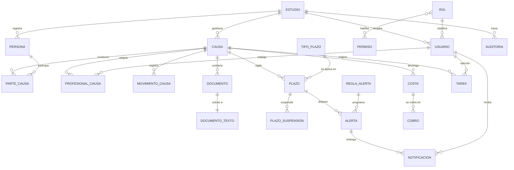
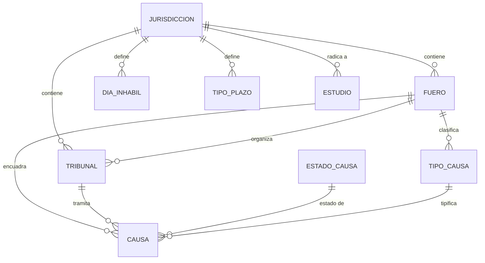
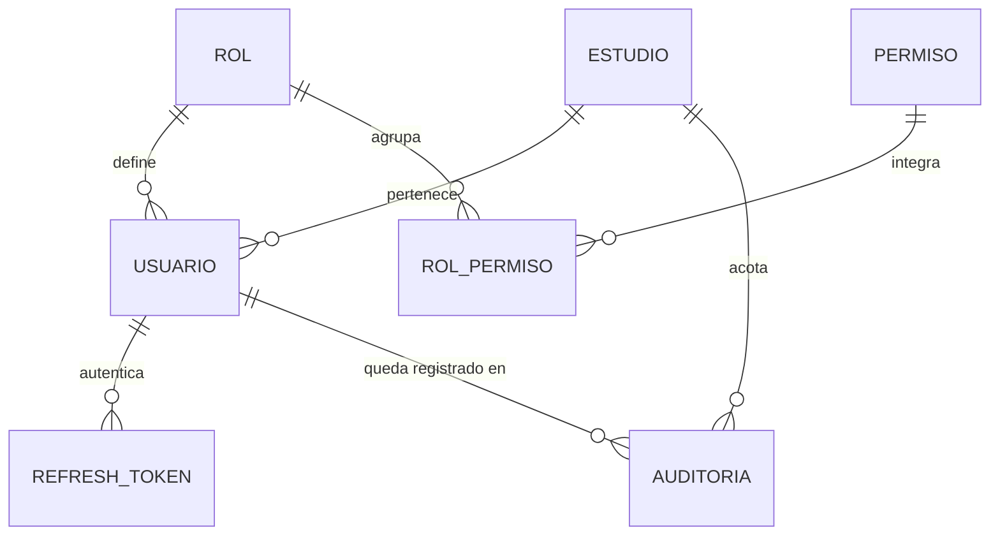

# Esquema de Base de Datos

## Sistema de Gestión Integral para Estudios Jurídicos

Trabajo Final Integrador — 2.ª Entrega
Martín Maine · Gevont Utmazian — Tutor: Sergio Andrés Antonini

Modelo relacional PostgreSQL: **34 tablas · 3 vistas · 73 claves foráneas**, en
Tercera Forma Normal.

El SQL ejecutable está en [`../database/`](../database/): migraciones
versionadas, esquema consolidado y datos de prueba ficticios.

Documentos relacionados: [arquitectura](arquitectura.md) ·
[listado de módulos](listado-modulos.md) · [propuesta (1.ª entrega)](propuesta-proyecto.md)

---

## 1. Criterios de diseño

### 1.1. Por qué un modelo relacional

La justificación se desarrolló en la Sección 5.2 de la propuesta y el diseño la
confirma en concreto:

| Criterio | Evidencia en este esquema |
|---|---|
| **Estructura estable y bien definida** | Las 34 tablas tienen columnas tipadas y acotadas; ninguna entidad requiere esquema variable. |
| **Relaciones densas entre entidades** | 73 claves foráneas. La consulta típica ("causas con vencimientos de esta semana y su responsable") cruza 5 tablas. |
| **Integridad transaccional** | Registrar un cobro modifica `cobro` y el `estado_cobro` de `costa` en una sola transacción. Son datos de dinero y de plazos perentorios: no admiten estados intermedios inconsistentes. |

### 1.2. Multi-inquilino (multi-estudio)

El sistema es **SaaS multi-estudio**: una sola instancia atiende a varios
estudios jurídicos. Esto es lo que da sentido al rol Super Admin declarado en la
propuesta.

La estrategia elegida es **base compartida con discriminador de inquilino**:

- `estudio` es la raíz del inquilino.
- Toda tabla de negocio lleva `estudio_id NOT NULL` con clave foránea e índice.
- `usuario.estudio_id` es la **única excepción nullable**, y solo para el
  Super Admin, que opera la plataforma y no pertenece a ningún estudio.

Se descartaron las alternativas: *una base por estudio* (inviable de operar y de
migrar con dos personas) y *un esquema por estudio* (mismo problema, con la
complicación adicional de las migraciones en paralelo).

> **Consecuencia para el backend:** el aislamiento entre inquilinos depende de
> que toda consulta filtre por `estudio_id`. Es una obligación del módulo de
> acceso a datos, no de la base. Se controla en un solo lugar (el repositorio
> base) para que no dependa de la disciplina de cada endpoint.

### 1.3. Convenciones

| Convención | Decisión | Motivo |
|---|---|---|
| **Idioma** | Español, `snake_case` | El dominio jurídico argentino no traduce limpio (*causa* ≠ *case*, *costas* ≠ *costs*). Traducirlo introduciría ambigüedad en el término más importante del sistema. |
| **Claves primarias** | `UUID` con `gen_random_uuid()` | Los identificadores viajan en las URL de una aplicación multi-inquilino; un entero secuencial permitiría enumerar expedientes ajenos. |
| **Excepción** | `auditoria.id` es `BIGINT` de identidad | Tabla *append-only* de alto volumen cuyo id nunca aparece en una URL: no hay riesgo de enumeración y sí un beneficio en tamaño de índice. |
| **Estados fijos** | `CHECK` con lista de valores | Alterar un `ENUM` de PostgreSQL exige migración; un `CHECK` se modifica sin recrear tipos. |
| **Valores configurables** | Tablas de catálogo | Lo que el estudio puede cambiar (tipos de causa, conceptos de costa, días inhábiles) es **dato**, no código. |
| **Fechas y horas** | `TIMESTAMPTZ` | Evita ambigüedad de huso horario. Para fechas procesales sin hora se usa `DATE`. |
| **Dinero** | `NUMERIC(14,2)` | Nunca punto flotante: los importes de costas y honorarios deben ser exactos. |
| **Borrado** | Lógico (`eliminado_en`) en `causa`, `persona`, `documento` | En materia legal no se destruye información. El resto de las tablas usa borrado físico con `ON DELETE` explícito. |
| **Auditoría de fila** | `creado_en` / `actualizado_en` | `actualizado_en` lo mantiene un trigger compartido, no la aplicación. |

### 1.4. Política de borrado en cascada

Cada clave foránea declara explícitamente su comportamiento. No se dejó ninguna
al valor por omisión:

| Comportamiento | Cuándo se usa | Ejemplo |
|---|---|---|
| `ON DELETE CASCADE` | El hijo no tiene sentido sin el padre | Borrar una `causa` borra sus `parte_causa`, `documento`, `plazo` |
| `ON DELETE RESTRICT` | El padre es un catálogo o una entidad que no debe desaparecer con datos vivos | No se puede borrar un `fuero` que tiene causas |
| `ON DELETE SET NULL` | El vínculo es informativo y su pérdida no invalida el registro | Dar de baja un usuario no borra la causa que creó ni su rastro de auditoría |

---

## 2. Diagrama entidad-relación

### 2.1. Vista general

### 2.2. Configuración jurisdiccional

El bloque que hace configurable la operación en otra provincia.

### 2.3. Seguridad y auditoría

---

## 3. Decisiones de modelado

Las siete decisiones que explican por qué el esquema tiene esta forma y no otra.

### 3.1. `persona` es reutilizable; el carácter procesal vive en el vínculo

Una persona **no** se guarda dentro de la causa. El estudio mantiene una agenda
única de personas, y `parte_causa` vincula persona con causa agregando el
carácter (`ACTOR`, `DEMANDADO`, `TERCERO`...).

*Por qué:* la misma persona puede ser demandada en un expediente y cliente en
otro. Si el carácter fuera un atributo de la persona, habría que duplicarla; y
al actualizar un domicilio se actualizaría en una copia sola.

La columna `parte_causa.es_cliente` marca a quién representa el estudio **en esa
causa**, porque tampoco eso es una propiedad estable de la persona.

### 3.2. El texto extraído del PDF vive en su propia tabla

`documento` guarda metadatos; `documento_texto` guarda el texto plano, en
relación 1:1.

*Por qué:* (a) el texto puede pesar megabytes y casi nunca se necesita al listar
documentos; (b) la extracción es **asíncrona** —la hace el microservicio Python—
así que tiene su propio ciclo de vida, su propia fecha y su propio mensaje de
error. `documento.estado_extraccion` funciona además como **cola de trabajo**
del microservicio, con un índice parcial que solo cubre las filas pendientes.

El binario del PDF **no se guarda en la base**: la tabla guarda la ruta al
almacenamiento de objetos. La base almacena metadatos, no archivos.

**La búsqueda es insensible a tildes, y eso no es un detalle cosmético.** El
diccionario español de PostgreSQL reduce `NOTIFICACIÓN` al lexema `notif`, pero
`NOTIFICACION` sin tilde no la reconoce y la deja entera como `notificacion`. Son
lexemas distintos: un abogado que busque sin tildes —lo normal— no encontraría el
documento. Por eso el índice normaliza el texto con `fn_sin_acentos()`, una
envoltura `IMMUTABLE` sobre `unaccent` (la función original es `STABLE` y
PostgreSQL no indexa expresiones que no sean inmutables).

> **Obligación para el módulo `documentos`:** la consulta debe normalizarse con
> la misma función. Si se normaliza solo el índice, la búsqueda vuelve a fallar
> con las tildes y además deja de usar el índice.

### 3.3. El cómputo de plazos se separa en regla, calendario e instancia

Es la pieza central del sistema y la mitigación del riesgo R3 de la propuesta.

| Tabla | Rol |
|---|---|
| `tipo_plazo` | La **regla**: cuántos días, hábiles o corridos, qué artículo la funda |
| `dia_inhabil` | El **calendario**: feriados, feria judicial, asuetos, por jurisdicción |
| `plazo` | La **instancia**: la regla aplicada a una causa concreta |

El algoritmo de cómputo **vive en el backend TypeScript, no en la base**, porque
debe poder probarse con los 10+ casos de prueba que exige el objetivo específico
n.º 2 de la propuesta. Una función PL/pgSQL sería mucho más difícil de cubrir con
pruebas automatizadas y quedaría fuera del monolito modular.

`plazo` persiste **a la vez los insumos y el resultado** del cálculo
(`fecha_notificacion`, `cantidad_dias`, `computo` → `fecha_vencimiento`):

- Guardar solo el resultado impediría auditar cómo se llegó a él.
- Guardar solo los insumos obligaría a recalcular en cada consulta y a suponer
  que el calendario histórico nunca cambia — supuesto falso: los feriados se
  fijan por decreto y pueden cargarse con posterioridad.

`fecha_vencimiento_original` conserva el primer cálculo, de modo que prórrogas y
suspensiones sean visibles sin perder el dato inicial.

**Ninguna regla ni ningún feriado está fijo en el código.** Habilitar otra
provincia es insertar filas en `jurisdiccion`, `fuero`, `tribunal`, `tipo_plazo`
y `dia_inhabil`. Es lo que sostiene la afirmación de arquitectura multi-provincia
de la propuesta.

### 3.4. Política, hecho y entrega son tres cosas distintas en las alertas

| Tabla | Concepto |
|---|---|
| `regla_alerta` | La **política**: "avisar 5 días antes, en nivel INFORMATIVA" |
| `alerta` | El **hecho**: "este plazo concreto dispara ese aviso el día X" |
| `notificacion` | La **entrega**: "a este usuario, por este canal, leída o no" |

*Por qué:* fusionarlas impediría avisar a varios responsables del mismo plazo con
un solo hecho de negocio, y haría imposible distinguir un aviso entregado pero no
leído de uno nunca entregado.

El índice único `uq_alerta_plazo_regla` hace **idempotente** al proceso
programado que recorre los vencimientos: si corre dos veces el mismo día, no
duplica avisos.

### 3.5. Costa y cobro son tablas separadas

`costa` es lo devengado; `cobro` es cada pago imputado, en relación 1:N.

*Por qué:* una costa puede cobrarse en cuotas. Un único campo `monto_cobrado` en
`costa` perdería el detalle de cada pago —fecha, medio, comprobante—, que es
justamente lo que exige el objetivo de "control de cobros pendientes".

`costa.estado_cobro` es **derivable** de la suma de cobros, pero se persiste para
poder indexar el tablero de cobranza sin agregar en cada consulta. Es una
desnormalización deliberada; la vista `vw_costa_saldo` permite contrastarlo
contra la suma real y detectar cualquier divergencia.

### 3.6. La auditoría es una tabla genérica, no un historial por entidad

`auditoria` usa `entidad` + `entidad_id` + `datos_antes`/`datos_despues` en
`JSONB`.

*Por qué:* el requisito es registrar "acciones sensibles" sobre cualquier
entidad. Una tabla de historial por entidad duplicaría el esquema y obligaría a
tocar la auditoría cada vez que se agrega una tabla de negocio. Con este diseño,
auditar algo nuevo no requiere ninguna migración.

`usuario_id` es `ON DELETE SET NULL`: dar de baja a un usuario **no puede borrar
el rastro de lo que hizo**. Su identidad queda preservada dentro de `datos_antes`.

### 3.7. Las funciones de IA no tienen dependientes

Ninguna tabla del núcleo referencia a `consulta_ia`; la dependencia va siempre en
sentido contrario. Es lo que permite la **degradación elegante** exigida por el
riesgo R4: sin clave de API el sistema funciona completo, y el estado
`SIN_SERVICIO` deja constancia de las consultas que no se pudieron atender.

Registrar `tokens_entrada`, `tokens_salida` y `costo_estimado` permite controlar
el gasto de la API, que es precisamente lo que hace riesgosa la dependencia.

---

## 4. Normalización

El esquema está en **Tercera Forma Normal (3FN)**:

| Forma | Verificación |
|---|---|
| **1FN** | Todos los atributos son atómicos. No hay campos multivaluados ni listas separadas por comas: las relaciones N:M se resuelven con tablas (`parte_causa`, `profesional_causa`, `rol_permiso`). Las únicas columnas `JSONB` son `auditoria.datos_antes`/`datos_despues`, que almacenan una *fotografía* sin estructura fija por diseño y sobre las que no se consulta atributo por atributo. |
| **2FN** | Ninguna tabla con clave compuesta tiene atributos que dependan de parte de la clave. `rol_permiso` es la única PK compuesta y no tiene atributos propios. |
| **3FN** | No hay dependencias transitivas. Los datos del tribunal no se repiten en `causa` (solo la FK); los de la persona no se repiten en `parte_causa`; los del concepto de costa no se repiten en `costa`. |

### Desnormalizaciones deliberadas

Se documentan porque son decisiones, no descuidos:

| Caso | Qué se duplica | Por qué se acepta |
|---|---|---|
| `costa.estado_cobro` | Derivable de `SUM(cobro.monto)` | Permite indexar el tablero de cobranza. Contrastable con `vw_costa_saldo`. |
| `plazo.cantidad_dias` y `plazo.computo` | Copiados de `tipo_plazo` al crear el plazo | **No es redundancia**: es una foto histórica. Si mañana se corrige la regla, los plazos ya computados deben conservar los parámetros con los que efectivamente se calcularon. |
| `plazo.fecha_vencimiento` | Derivable del cálculo | Ver la sección 3.3: sin esto el vencimiento dependería del estado actual del calendario. |

---

## 5. Reglas de negocio implementadas en la base

Se declararon en la base las reglas cuya violación dejaría datos sin sentido,
para que ningún error de la aplicación pueda producirlos.

| Regla | Mecanismo |
|---|---|
| Una persona física tiene nombre y apellido; una jurídica, razón social | `CHECK ck_persona_identificacion` |
| El Super Admin no pertenece a un estudio; los demás roles sí | Trigger `tg_usuario_ambito` (la regla cruza dos tablas, no puede ser un `CHECK`) |
| El cómputo de un plazo no empieza antes de la notificación | `CHECK ck_plazo_inicio_computo` |
| Un plazo cumplido tiene fecha de cumplimiento | `CHECK ck_plazo_cumplimiento` |
| Una tarea completada tiene fecha de finalización | `CHECK ck_tarea_completada` |
| Una alerta disparada tiene fecha de disparo | `CHECK ck_alerta_disparo` |
| Los importes son positivos | `CHECK` en `costa.monto`, `cobro.monto` |
| El cierre de una causa no es anterior a su inicio | `CHECK ck_causa_fechas` |
| El CUIT del estudio tiene formato válido | `CHECK ck_estudio_cuit_formato` (expresión regular) |
| No se sube dos veces el mismo archivo al mismo estudio | Índice único parcial sobre `hash_sha256` |
| Un expediente no se repite dentro del estudio | Índice único parcial sobre `(estudio_id, numero_expediente)` |
| Un profesional no se asigna dos veces a la vez a una causa | Índice único parcial `WHERE fecha_baja IS NULL` |
| El email de login es único sin distinguir mayúsculas | Índice único sobre `lower(email)` |
| `actualizado_en` siempre refleja el último cambio | Trigger `fn_actualizar_timestamp` |

> **Nota sobre índices únicos parciales:** se usan en lugar de `UNIQUE` ordinario
> donde hay borrado lógico o columnas nulas, porque un `UNIQUE` común trata cada
> `NULL` como distinto y no volvería a permitir el alta de un registro borrado.

---

## 6. Índices y consultas previstas

Los índices se derivaron de las consultas que el sistema va a hacer, no de una
regla general. Los principales:

| Índice | Consulta que atiende |
|---|---|
| `ix_plazo_vigilancia` (parcial) | "¿Qué vence próximamente en este estudio?" — la consulta más frecuente del sistema |
| `ix_dia_inhabil_busqueda` | El motor de cómputo pide el rango de inhábiles de una jurisdicción |
| `ix_documento_pendiente_extraccion` (parcial) | Cola de trabajo del microservicio PDF |
| `ix_alerta_pendiente` (parcial) | Cola del proceso programado que dispara avisos |
| `ix_costa_pendiente` (parcial) | Tablero de cobranza |
| `ix_notificacion_bandeja` (parcial) | Bandeja de no leídas del usuario |
| `ix_auditoria_entidad` | "Todo lo que le pasó a esta causa" |
| `ix_documento_texto_busqueda` (GIN) | Búsqueda de texto completo en español dentro de los PDF, **insensible a tildes** |

Los índices parciales (`WHERE ...`) cubren solo las filas que las consultas
recorren —plazos abiertos, alertas sin disparar, notificaciones sin leer—, lo que
los mantiene pequeños aunque la tabla crezca.

---

## 7. Vistas

Concentran los `JOIN` que el backend repetiría en varios endpoints. No agregan
reglas de negocio.

| Vista | Para qué |
|---|---|
| `vw_plazo_vigente` | Panel de vencimientos y calendario: plazos abiertos con su causa y responsable |
| `vw_costa_saldo` | Control de cobros y reporte de gastos exportable: cobrado y saldo por costa |
| `vw_causa_resumen` | Listado de causas con sus contadores y próximo vencimiento, sin consultas N+1 |

---

## 8. Diccionario de datos

Esta sección se corresponde una a una con el DDL de
[`../database/migrations/`](../database/migrations/): cada tabla indica de qué
migración proviene.

Tipos abreviados: `TIMESTAMPTZ` = marca temporal con huso horario ·
`NUMERIC(14,2)` = decimal exacto para importes · `UUID` = identificador único.
Salvo indicación contraria, las columnas `id` son `gen_random_uuid()` por
omisión y las columnas `creado_en` / `actualizado_en` son `now()`.

### Catálogos jurídicos

> Origen: `database/migrations/002_catalogos_juridicos.sql`

#### `jurisdiccion`

| Columna | Tipo | Nulo | Notas |
|---|---|---|---|
| `id` | UUID | no | **PK** |
| `codigo` | VARCHAR(10) | no | UNIQUE |
| `nombre` | VARCHAR(100) | no |  |
| `pais` | VARCHAR(50) | no |  |
| `activa` | BOOLEAN | no |  |
| `creado_en` | TIMESTAMPTZ | no |  |

#### `fuero`

| Columna | Tipo | Nulo | Notas |
|---|---|---|---|
| `id` | UUID | no | **PK** |
| `jurisdiccion_id` | UUID | no | FK → `jurisdiccion` |
| `codigo` | VARCHAR(20) | no |  |
| `nombre` | VARCHAR(100) | no |  |
| `activo` | BOOLEAN | no |  |
| `creado_en` | TIMESTAMPTZ | no |  |

Restricciones de tabla: `uq_fuero_jurisdiccion_codigo (UNIQUE jurisdiccion_id, codigo)`

#### `tribunal`

| Columna | Tipo | Nulo | Notas |
|---|---|---|---|
| `id` | UUID | no | **PK** |
| `jurisdiccion_id` | UUID | no | FK → `jurisdiccion` |
| `fuero_id` | UUID | no | FK → `fuero` |
| `nombre` | VARCHAR(200) | no |  |
| `nominacion` | VARCHAR(50) | sí |  |
| `circunscripcion` | VARCHAR(100) | sí |  |
| `sede` | VARCHAR(100) | sí |  |
| `domicilio` | VARCHAR(200) | sí |  |
| `activo` | BOOLEAN | no |  |
| `creado_en` | TIMESTAMPTZ | no |  |

Restricciones de tabla: `uq_tribunal_identidad (UNIQUE jurisdiccion_id, fuero_id, nombre, nominacion)`

#### `tipo_causa`

| Columna | Tipo | Nulo | Notas |
|---|---|---|---|
| `id` | UUID | no | **PK** |
| `fuero_id` | UUID | no | FK → `fuero` |
| `codigo` | VARCHAR(30) | no |  |
| `nombre` | VARCHAR(150) | no |  |
| `activo` | BOOLEAN | no |  |
| `creado_en` | TIMESTAMPTZ | no |  |

Restricciones de tabla: `uq_tipo_causa_fuero_codigo (UNIQUE fuero_id, codigo)`

#### `estado_causa`

| Columna | Tipo | Nulo | Notas |
|---|---|---|---|
| `id` | UUID | no | **PK** |
| `codigo` | VARCHAR(30) | no | UNIQUE |
| `nombre` | VARCHAR(100) | no |  |
| `es_final` | BOOLEAN | no |  |
| `orden` | SMALLINT | no |  |
| `creado_en` | TIMESTAMPTZ | no |  |

#### `tipo_documento`

| Columna | Tipo | Nulo | Notas |
|---|---|---|---|
| `id` | UUID | no | **PK** |
| `codigo` | VARCHAR(30) | no | UNIQUE |
| `nombre` | VARCHAR(100) | no |  |
| `activo` | BOOLEAN | no |  |
| `creado_en` | TIMESTAMPTZ | no |  |

#### `concepto_costa`

| Columna | Tipo | Nulo | Notas |
|---|---|---|---|
| `id` | UUID | no | **PK** |
| `codigo` | VARCHAR(30) | no | UNIQUE |
| `nombre` | VARCHAR(100) | no |  |
| `descripcion` | VARCHAR(300) | sí |  |
| `activo` | BOOLEAN | no |  |
| `creado_en` | TIMESTAMPTZ | no |  |

### Tenencia y seguridad

> Origen: `database/migrations/003_tenencia_y_seguridad.sql`

#### `estudio`

| Columna | Tipo | Nulo | Notas |
|---|---|---|---|
| `id` | UUID | no | **PK** |
| `razon_social` | VARCHAR(150) | no |  |
| `nombre_fantasia` | VARCHAR(150) | sí |  |
| `cuit` | VARCHAR(13) | no | UNIQUE |
| `email_contacto` | VARCHAR(150) | sí |  |
| `telefono` | VARCHAR(30) | sí |  |
| `domicilio` | VARCHAR(200) | sí |  |
| `jurisdiccion_id` | UUID | no | FK → `jurisdiccion` |
| `activo` | BOOLEAN | no |  |
| `creado_en` | TIMESTAMPTZ | no |  |
| `actualizado_en` | TIMESTAMPTZ | no |  |

Restricciones de tabla: `ck_estudio_cuit_formato`

#### `rol`

| Columna | Tipo | Nulo | Notas |
|---|---|---|---|
| `id` | UUID | no | **PK** |
| `codigo` | VARCHAR(20) | no | UNIQUE |
| `nombre` | VARCHAR(60) | no |  |
| `descripcion` | VARCHAR(300) | sí |  |
| `jerarquia` | SMALLINT | no |  |
| `creado_en` | TIMESTAMPTZ | no |  |

Restricciones de tabla: `ck_rol_codigo`

#### `permiso`

| Columna | Tipo | Nulo | Notas |
|---|---|---|---|
| `id` | UUID | no | **PK** |
| `codigo` | VARCHAR(60) | no | UNIQUE |
| `modulo` | VARCHAR(40) | no |  |
| `accion` | VARCHAR(40) | no |  |
| `descripcion` | VARCHAR(300) | sí |  |
| `creado_en` | TIMESTAMPTZ | no |  |

#### `rol_permiso`

| Columna | Tipo | Nulo | Notas |
|---|---|---|---|
| `rol_id` | UUID | no | **PK**, FK → `rol` |
| `permiso_id` | UUID | no | **PK**, FK → `permiso` |

#### `usuario`

| Columna | Tipo | Nulo | Notas |
|---|---|---|---|
| `id` | UUID | no | **PK** |
| `estudio_id` | UUID | sí | FK → `estudio` |
| `rol_id` | UUID | no | FK → `rol` |
| `email` | VARCHAR(150) | no |  |
| `password_hash` | VARCHAR(255) | no |  |
| `nombre` | VARCHAR(80) | no |  |
| `apellido` | VARCHAR(80) | no |  |
| `matricula` | VARCHAR(50) | sí |  |
| `telefono` | VARCHAR(30) | sí |  |
| `activo` | BOOLEAN | no |  |
| `ultimo_acceso_en` | TIMESTAMPTZ | sí |  |
| `creado_en` | TIMESTAMPTZ | no |  |
| `actualizado_en` | TIMESTAMPTZ | no |  |

Restricciones de tabla: `ck_usuario_email_formato`

#### `refresh_token`

| Columna | Tipo | Nulo | Notas |
|---|---|---|---|
| `id` | UUID | no | **PK** |
| `usuario_id` | UUID | no | FK → `usuario` |
| `token_hash` | CHAR(64) | no | UNIQUE |
| `emitido_en` | TIMESTAMPTZ | no |  |
| `expira_en` | TIMESTAMPTZ | no |  |
| `revocado_en` | TIMESTAMPTZ | sí |  |
| `ip` | INET | sí |  |
| `user_agent` | VARCHAR(300) | sí |  |

Restricciones de tabla: `ck_refresh_token_vigencia`

### Causas

> Origen: `database/migrations/004_causas.sql`

#### `persona`

| Columna | Tipo | Nulo | Notas |
|---|---|---|---|
| `id` | UUID | no | **PK** |
| `estudio_id` | UUID | no | FK → `estudio` |
| `tipo_persona` | VARCHAR(10) | no |  |
| `nombre` | VARCHAR(80) | sí |  |
| `apellido` | VARCHAR(80) | sí |  |
| `razon_social` | VARCHAR(150) | sí |  |
| `tipo_documento` | VARCHAR(10) | sí |  |
| `numero_documento` | VARCHAR(20) | sí |  |
| `cuit_cuil` | VARCHAR(13) | sí |  |
| `email` | VARCHAR(150) | sí |  |
| `telefono` | VARCHAR(30) | sí |  |
| `domicilio` | VARCHAR(200) | sí |  |
| `localidad` | VARCHAR(100) | sí |  |
| `provincia` | VARCHAR(100) | sí |  |
| `observaciones` | TEXT | sí |  |
| `eliminado_en` | TIMESTAMPTZ | sí |  |
| `creado_en` | TIMESTAMPTZ | no |  |
| `actualizado_en` | TIMESTAMPTZ | no |  |

Restricciones de tabla: `ck_persona_tipo`, `ck_persona_tipo_documento`, `ck_persona_identificacion`

#### `causa`

| Columna | Tipo | Nulo | Notas |
|---|---|---|---|
| `id` | UUID | no | **PK** |
| `estudio_id` | UUID | no | FK → `estudio` |
| `numero_expediente` | VARCHAR(50) | sí |  |
| `caratula` | VARCHAR(300) | no |  |
| `tribunal_id` | UUID | sí | FK → `tribunal` |
| `fuero_id` | UUID | no | FK → `fuero` |
| `tipo_causa_id` | UUID | sí | FK → `tipo_causa` |
| `estado_causa_id` | UUID | no | FK → `estado_causa` |
| `fecha_inicio` | DATE | no |  |
| `fecha_cierre` | DATE | sí |  |
| `monto_reclamado` | NUMERIC(14,2) | sí |  |
| `moneda` | CHAR(3) | no |  |
| `observaciones` | TEXT | sí |  |
| `creado_por` | UUID | sí | FK → `usuario` |
| `eliminado_en` | TIMESTAMPTZ | sí |  |
| `creado_en` | TIMESTAMPTZ | no |  |
| `actualizado_en` | TIMESTAMPTZ | no |  |

Restricciones de tabla: `ck_causa_fechas`, `ck_causa_monto`

#### `parte_causa`

| Columna | Tipo | Nulo | Notas |
|---|---|---|---|
| `id` | UUID | no | **PK** |
| `causa_id` | UUID | no | FK → `causa` |
| `persona_id` | UUID | no | FK → `persona` |
| `caracter` | VARCHAR(20) | no |  |
| `es_cliente` | BOOLEAN | no |  |
| `fecha_alta` | DATE | no |  |
| `observaciones` | VARCHAR(300) | sí |  |
| `creado_en` | TIMESTAMPTZ | no |  |

Restricciones de tabla: `ck_parte_caracter`, `uq_parte_causa (UNIQUE causa_id, persona_id, caracter)`

#### `profesional_causa`

| Columna | Tipo | Nulo | Notas |
|---|---|---|---|
| `id` | UUID | no | **PK** |
| `causa_id` | UUID | no | FK → `causa` |
| `usuario_id` | UUID | no | FK → `usuario` |
| `rol_en_causa` | VARCHAR(20) | no |  |
| `fecha_asignacion` | DATE | no |  |
| `fecha_baja` | DATE | sí |  |
| `creado_en` | TIMESTAMPTZ | no |  |

Restricciones de tabla: `ck_profesional_rol`, `ck_profesional_fechas`

#### `movimiento_causa`

| Columna | Tipo | Nulo | Notas |
|---|---|---|---|
| `id` | UUID | no | **PK** |
| `causa_id` | UUID | no | FK → `causa` |
| `fecha` | DATE | no |  |
| `tipo` | VARCHAR(100) | sí |  |
| `descripcion` | TEXT | no |  |
| `origen` | VARCHAR(20) | no |  |
| `referencia_externa` | VARCHAR(100) | sí |  |
| `registrado_por` | UUID | sí | FK → `usuario` |
| `creado_en` | TIMESTAMPTZ | no |  |

Restricciones de tabla: `ck_movimiento_origen`

### Documentos

> Origen: `database/migrations/005_documentos.sql`

#### `documento`

| Columna | Tipo | Nulo | Notas |
|---|---|---|---|
| `id` | UUID | no | **PK** |
| `estudio_id` | UUID | no | FK → `estudio` |
| `causa_id` | UUID | no | FK → `causa` |
| `tipo_documento_id` | UUID | sí | FK → `tipo_documento` |
| `nombre_archivo` | VARCHAR(255) | no |  |
| `nombre_original` | VARCHAR(255) | no |  |
| `mime_type` | VARCHAR(100) | no |  |
| `tamano_bytes` | BIGINT | no |  |
| `ruta_almacenamiento` | VARCHAR(500) | no |  |
| `hash_sha256` | CHAR(64) | no |  |
| `estado_extraccion` | VARCHAR(20) | no |  |
| `descripcion` | VARCHAR(300) | sí |  |
| `subido_por` | UUID | sí | FK → `usuario` |
| `fecha_subida` | TIMESTAMPTZ | no |  |
| `eliminado_en` | TIMESTAMPTZ | sí |  |

Restricciones de tabla: `ck_documento_tamano`, `ck_documento_estado_extraccion`

#### `documento_texto`

| Columna | Tipo | Nulo | Notas |
|---|---|---|---|
| `documento_id` | UUID | no | **PK**, FK → `documento` |
| `texto` | TEXT | sí |  |
| `cantidad_paginas` | INTEGER | sí |  |
| `motor_extraccion` | VARCHAR(50) | no |  |
| `fecha_extraccion` | TIMESTAMPTZ | no |  |
| `mensaje_error` | TEXT | sí |  |

Restricciones de tabla: `ck_documento_texto_paginas`

### Plazos y calendario

> Origen: `database/migrations/006_plazos_y_calendario.sql`

#### `tipo_plazo`

| Columna | Tipo | Nulo | Notas |
|---|---|---|---|
| `id` | UUID | no | **PK** |
| `estudio_id` | UUID | sí | FK → `estudio` |
| `jurisdiccion_id` | UUID | no | FK → `jurisdiccion` |
| `fuero_id` | UUID | sí | FK → `fuero` |
| `codigo` | VARCHAR(50) | no |  |
| `nombre` | VARCHAR(150) | no |  |
| `cantidad_dias` | SMALLINT | no |  |
| `computo` | VARCHAR(10) | no |  |
| `articulo_referencia` | VARCHAR(100) | sí |  |
| `prorrogable` | BOOLEAN | no |  |
| `activo` | BOOLEAN | no |  |
| `creado_en` | TIMESTAMPTZ | no |  |

Restricciones de tabla: `ck_tipo_plazo_dias`, `ck_tipo_plazo_computo`

#### `dia_inhabil`

| Columna | Tipo | Nulo | Notas |
|---|---|---|---|
| `id` | UUID | no | **PK** |
| `jurisdiccion_id` | UUID | no | FK → `jurisdiccion` |
| `estudio_id` | UUID | sí | FK → `estudio` |
| `fecha` | DATE | no |  |
| `tipo` | VARCHAR(25) | no |  |
| `motivo` | VARCHAR(200) | no |  |
| `creado_en` | TIMESTAMPTZ | no |  |

Restricciones de tabla: `ck_dia_inhabil_tipo`

#### `plazo`

| Columna | Tipo | Nulo | Notas |
|---|---|---|---|
| `id` | UUID | no | **PK** |
| `estudio_id` | UUID | no | FK → `estudio` |
| `causa_id` | UUID | no | FK → `causa` |
| `tipo_plazo_id` | UUID | sí | FK → `tipo_plazo` |
| `descripcion` | VARCHAR(300) | no |  |
| `fecha_notificacion` | DATE | no |  |
| `fecha_inicio_computo` | DATE | no |  |
| `cantidad_dias` | SMALLINT | no |  |
| `computo` | VARCHAR(10) | no |  |
| `fecha_vencimiento` | DATE | no |  |
| `fecha_vencimiento_original` | DATE | no |  |
| `estado` | VARCHAR(15) | no |  |
| `responsable_id` | UUID | sí | FK → `usuario` |
| `fecha_cumplimiento` | DATE | sí |  |
| `observaciones` | TEXT | sí |  |
| `creado_por` | UUID | sí | FK → `usuario` |
| `creado_en` | TIMESTAMPTZ | no |  |
| `actualizado_en` | TIMESTAMPTZ | no |  |

Restricciones de tabla: `ck_plazo_dias`, `ck_plazo_computo`, `ck_plazo_estado`, `ck_plazo_inicio_computo`, `ck_plazo_vencimiento`, `ck_plazo_cumplimiento`

#### `plazo_suspension`

| Columna | Tipo | Nulo | Notas |
|---|---|---|---|
| `id` | UUID | no | **PK** |
| `plazo_id` | UUID | no | FK → `plazo` |
| `fecha_desde` | DATE | no |  |
| `fecha_hasta` | DATE | sí |  |
| `motivo` | VARCHAR(200) | no |  |
| `registrado_por` | UUID | sí | FK → `usuario` |
| `creado_en` | TIMESTAMPTZ | no |  |

Restricciones de tabla: `ck_plazo_suspension_fechas`

#### `evento_calendario`

| Columna | Tipo | Nulo | Notas |
|---|---|---|---|
| `id` | UUID | no | **PK** |
| `estudio_id` | UUID | no | FK → `estudio` |
| `causa_id` | UUID | sí | FK → `causa` |
| `plazo_id` | UUID | sí | FK → `plazo` |
| `titulo` | VARCHAR(200) | no |  |
| `descripcion` | TEXT | sí |  |
| `tipo` | VARCHAR(20) | no |  |
| `fecha_inicio` | TIMESTAMPTZ | no |  |
| `fecha_fin` | TIMESTAMPTZ | no |  |
| `todo_el_dia` | BOOLEAN | no |  |
| `lugar` | VARCHAR(200) | sí |  |
| `creado_por` | UUID | sí | FK → `usuario` |
| `creado_en` | TIMESTAMPTZ | no |  |
| `actualizado_en` | TIMESTAMPTZ | no |  |

Restricciones de tabla: `ck_evento_tipo`, `ck_evento_fechas`

### Alertas y notificaciones

> Origen: `database/migrations/007_alertas_y_notificaciones.sql`

#### `regla_alerta`

| Columna | Tipo | Nulo | Notas |
|---|---|---|---|
| `id` | UUID | no | **PK** |
| `estudio_id` | UUID | no | FK → `estudio` |
| `tipo_plazo_id` | UUID | sí | FK → `tipo_plazo` |
| `dias_anticipacion` | SMALLINT | no |  |
| `nivel` | VARCHAR(12) | no |  |
| `activa` | BOOLEAN | no |  |
| `creado_en` | TIMESTAMPTZ | no |  |

Restricciones de tabla: `ck_regla_alerta_dias`, `ck_regla_alerta_nivel`

#### `alerta`

| Columna | Tipo | Nulo | Notas |
|---|---|---|---|
| `id` | UUID | no | **PK** |
| `estudio_id` | UUID | no | FK → `estudio` |
| `plazo_id` | UUID | no | FK → `plazo` |
| `regla_alerta_id` | UUID | sí | FK → `regla_alerta` |
| `nivel` | VARCHAR(12) | no |  |
| `fecha_programada` | DATE | no |  |
| `mensaje` | VARCHAR(500) | no |  |
| `estado` | VARCHAR(15) | no |  |
| `disparada_en` | TIMESTAMPTZ | sí |  |
| `creado_en` | TIMESTAMPTZ | no |  |

Restricciones de tabla: `ck_alerta_nivel`, `ck_alerta_estado`, `ck_alerta_disparo`

#### `notificacion`

| Columna | Tipo | Nulo | Notas |
|---|---|---|---|
| `id` | UUID | no | **PK** |
| `usuario_id` | UUID | no | FK → `usuario` |
| `alerta_id` | UUID | sí | FK → `alerta` |
| `titulo` | VARCHAR(200) | no |  |
| `mensaje` | VARCHAR(500) | no |  |
| `canal` | VARCHAR(10) | no |  |
| `enviada_en` | TIMESTAMPTZ | sí |  |
| `leida_en` | TIMESTAMPTZ | sí |  |
| `creado_en` | TIMESTAMPTZ | no |  |

Restricciones de tabla: `ck_notificacion_canal`

### Costas

> Origen: `database/migrations/008_costas.sql`

#### `costa`

| Columna | Tipo | Nulo | Notas |
|---|---|---|---|
| `id` | UUID | no | **PK** |
| `estudio_id` | UUID | no | FK → `estudio` |
| `causa_id` | UUID | no | FK → `causa` |
| `concepto_costa_id` | UUID | no | FK → `concepto_costa` |
| `descripcion` | VARCHAR(300) | sí |  |
| `monto` | NUMERIC(14,2) | no |  |
| `moneda` | CHAR(3) | no |  |
| `fecha_devengamiento` | DATE | no |  |
| `fecha_vencimiento_pago` | DATE | sí |  |
| `a_cargo_de` | VARCHAR(12) | no |  |
| `estado_cobro` | VARCHAR(12) | no |  |
| `comprobante` | VARCHAR(100) | sí |  |
| `registrado_por` | UUID | sí | FK → `usuario` |
| `creado_en` | TIMESTAMPTZ | no |  |
| `actualizado_en` | TIMESTAMPTZ | no |  |

Restricciones de tabla: `ck_costa_monto`, `ck_costa_a_cargo`, `ck_costa_estado`, `ck_costa_fechas`

#### `cobro`

| Columna | Tipo | Nulo | Notas |
|---|---|---|---|
| `id` | UUID | no | **PK** |
| `costa_id` | UUID | no | FK → `costa` |
| `monto` | NUMERIC(14,2) | no |  |
| `fecha` | DATE | no |  |
| `medio_pago` | VARCHAR(15) | no |  |
| `comprobante` | VARCHAR(100) | sí |  |
| `observaciones` | VARCHAR(300) | sí |  |
| `registrado_por` | UUID | sí | FK → `usuario` |
| `creado_en` | TIMESTAMPTZ | no |  |

Restricciones de tabla: `ck_cobro_monto`, `ck_cobro_medio`

### Plantillas y tareas

> Origen: `database/migrations/009_operacion.sql`

#### `plantilla_escrito`

| Columna | Tipo | Nulo | Notas |
|---|---|---|---|
| `id` | UUID | no | **PK** |
| `estudio_id` | UUID | sí | FK → `estudio` |
| `tipo_documento_id` | UUID | sí | FK → `tipo_documento` |
| `fuero_id` | UUID | sí | FK → `fuero` |
| `tribunal_id` | UUID | sí | FK → `tribunal` |
| `nombre` | VARCHAR(150) | no |  |
| `descripcion` | VARCHAR(300) | sí |  |
| `contenido` | TEXT | no |  |
| `version` | SMALLINT | no |  |
| `activa` | BOOLEAN | no |  |
| `creada_por` | UUID | sí | FK → `usuario` |
| `creado_en` | TIMESTAMPTZ | no |  |
| `actualizado_en` | TIMESTAMPTZ | no |  |

Restricciones de tabla: `ck_plantilla_version`

#### `tarea`

| Columna | Tipo | Nulo | Notas |
|---|---|---|---|
| `id` | UUID | no | **PK** |
| `estudio_id` | UUID | no | FK → `estudio` |
| `causa_id` | UUID | sí | FK → `causa` |
| `plazo_id` | UUID | sí | FK → `plazo` |
| `titulo` | VARCHAR(200) | no |  |
| `descripcion` | TEXT | sí |  |
| `asignada_a` | UUID | sí | FK → `usuario` |
| `creada_por` | UUID | sí | FK → `usuario` |
| `prioridad` | VARCHAR(6) | no |  |
| `estado` | VARCHAR(12) | no |  |
| `fecha_vencimiento` | DATE | sí |  |
| `completada_en` | TIMESTAMPTZ | sí |  |
| `creado_en` | TIMESTAMPTZ | no |  |
| `actualizado_en` | TIMESTAMPTZ | no |  |

Restricciones de tabla: `ck_tarea_prioridad`, `ck_tarea_estado`, `ck_tarea_completada`

### IA (opcional)

> Origen: `database/migrations/010_ia.sql`

#### `consulta_ia`

| Columna | Tipo | Nulo | Notas |
|---|---|---|---|
| `id` | UUID | no | **PK** |
| `estudio_id` | UUID | no | FK → `estudio` |
| `usuario_id` | UUID | sí | FK → `usuario` |
| `causa_id` | UUID | sí | FK → `causa` |
| `documento_id` | UUID | sí | FK → `documento` |
| `tipo` | VARCHAR(30) | no |  |
| `prompt` | TEXT | no |  |
| `respuesta` | TEXT | sí |  |
| `modelo` | VARCHAR(80) | sí |  |
| `tokens_entrada` | INTEGER | sí |  |
| `tokens_salida` | INTEGER | sí |  |
| `costo_estimado` | NUMERIC(10,4) | sí |  |
| `estado` | VARCHAR(12) | no |  |
| `mensaje_error` | TEXT | sí |  |
| `creado_en` | TIMESTAMPTZ | no |  |

Restricciones de tabla: `ck_consulta_ia_tipo`, `ck_consulta_ia_estado`, `ck_consulta_ia_tokens`

### Auditoría

> Origen: `database/migrations/011_auditoria.sql`

#### `auditoria`

| Columna | Tipo | Nulo | Notas |
|---|---|---|---|
| `id` | BIGINT | no | **PK**, identidad |
| `estudio_id` | UUID | sí | FK → `estudio` |
| `usuario_id` | UUID | sí | FK → `usuario` |
| `entidad` | VARCHAR(60) | no |  |
| `entidad_id` | UUID | sí |  |
| `accion` | VARCHAR(20) | no |  |
| `datos_antes` | JSONB | sí |  |
| `datos_despues` | JSONB | sí |  |
| `ip` | INET | sí |  |
| `user_agent` | VARCHAR(300) | sí |  |
| `ocurrido_en` | TIMESTAMPTZ | no |  |

Restricciones de tabla: `ck_auditoria_accion`

---

## 9. Pendientes

### 9.1. Verificación jurídica

- **Artículos del CPCC de Córdoba (Ley 8465).** Los `tipo_plazo` del seed tienen
  `articulo_referencia` en `NULL` **a propósito**: no se inventaron citas
  legales. Deben tomarse del texto oficial. Los valores de `cantidad_dias` son
  los de uso corriente y también requieren confirmación.
- **Calendario oficial.** Los feriados trasladables se fijan por decreto cada año
  y las fechas de la feria judicial de julio las establece el TSJ por Acuerdo
  Reglamentario.
- **Padrón de tribunales.** El seed carga un subconjunto para desarrollo.

### 9.2. Técnicos, para los próximos sprints

- Aplicar el esquema sobre la instancia de Neon del proyecto y sobre el
  `docker-compose` del entorno local (S0).
- Elegir el almacenamiento de objetos para los PDF: `documento.ruta_almacenamiento`
  admite tanto disco local como almacenamiento externo; la decisión se toma en S2.
- Definir el cifrado en reposo de los campos sensibles (riesgo R5). El esquema
  está preparado, pero la estrategia se define en S5 (*hardening*).
- Escribir los 10+ casos de prueba del motor de cómputo (S2).

---
